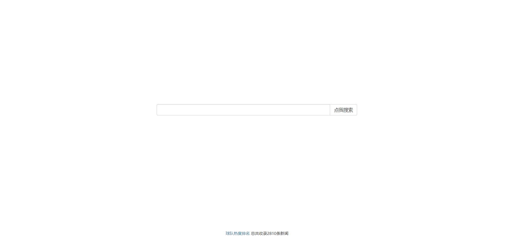
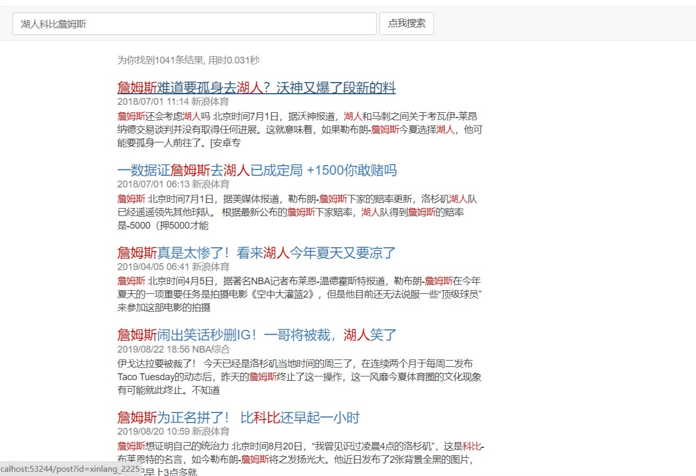
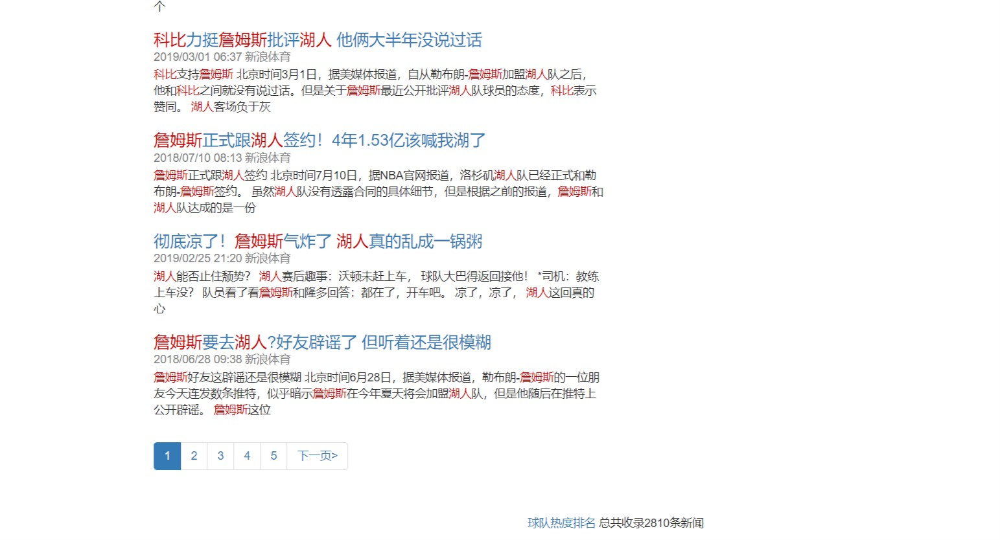
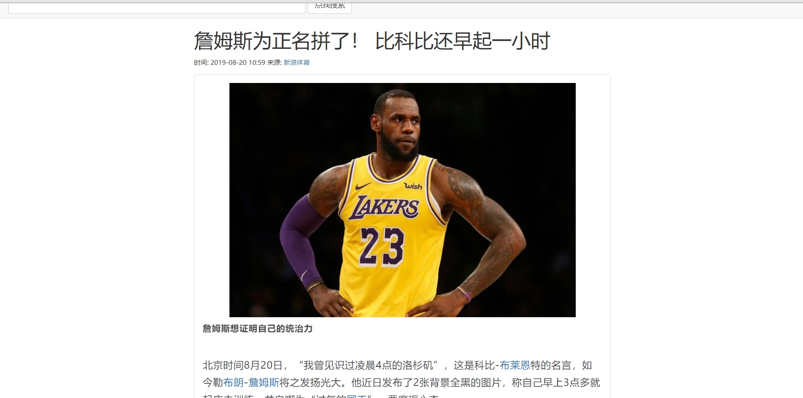
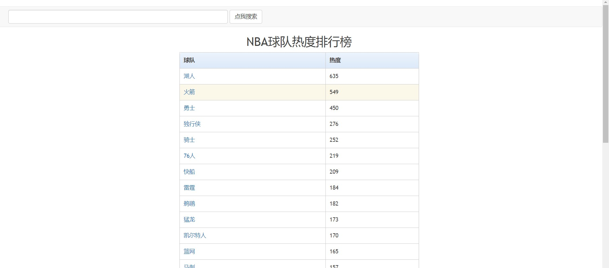
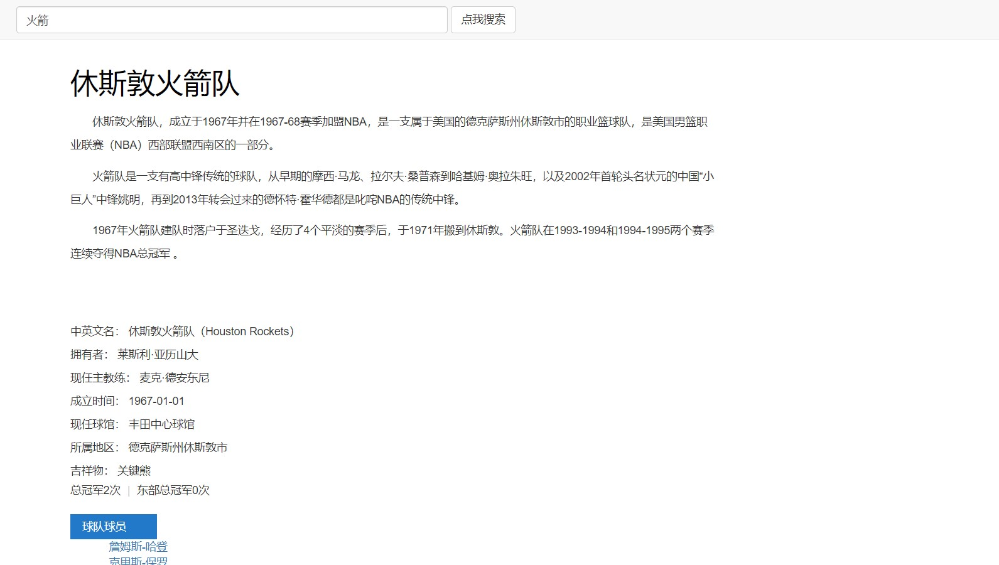
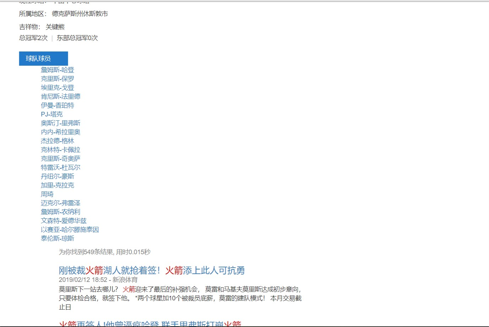

# NBA新闻搜索引擎

##### 2018011365 张鹤潇

### 概述

本程序使用Django框架编写，用于NBA新闻搜索。在完成了所有功能基础的基础上，用TF-IDF算法实现了多关键词搜索。总计爬取2810条新闻，除第一次搜索需要加载jieba分词模块之外，搜索时间稳定在0.05秒以内。

### 开发环境

vs 2019/python 3.7(64-bit)

Django 2.2.1

requests-html 0.10.0

jieba 0.39

### 运行方法

初始化爬虫：

```python
python news_spider.py
python teams_spider.py
```

爬取过程中，如果卡顿明显，请尝试换个IP. 

在`web`文件夹下，运行：

```
python manage.py makemigrations
python manage.py migrate
```

初始化数据库。再运行：

```
python manage.py update_news.py
python manage.py update_teams.py
```

加载数据。

最后, 启动服务器：

```python
python manage.py runserver
```

### 功能展示

##### 主页

##### 搜索页



##### 新闻页



##### 球队热度排行


##### 球队主页




### 架构与算法简述

spider文件夹下为爬虫模块；web文件夹下为Django项目模块.

#### 网络爬虫

使用`requests-html`+`CSS选择器`进行网页爬取和HTML解析。

网页爬取的思路是从几个根节点开始进行BFS，每次访问新的网页时，检查其中所有的链接，并将合法的链接加入队列中。NBA新闻爬取于<www.sports.sina.com.cn>，球队信息爬取于<www.qiumiwu.com/team>.

爬取的数据通过`json`库存储于`json`格式的文件中，供Django模块读取。

#### Django模块

遵照Django的MTV开发模式进行设计。用Django自带的SQLite管理后端数据，HTML/CSS设计网页，jQuery/Ajax更新前端数据。

##### Models

数据库创建于`postdb`App中，定义如下：

`PostInfo`存储新闻信息:

```python
NID = models.IntegerField() #新闻的数字编号
time = models.DateTimeField() #时间
title = models.TextField() #标题
content = models.TextField() #内容(HTML)
plain = models.TextField() #内容(text)
url = models.TextField() #一级来源链接
sourceLink = models.TextField() #二级来源链接
sourceText = models.TextField() #二级来源名称
```

`PlayerInfo`存储球员信息:

```python
name = models.CharField(max_length=20)#姓名
team = models.CharField(max_length=20)#所属球队
```

`TeamInfo`存储球队信息：

```python
name = models.CharField(max_length=20) #名称
content = models.TextField() #主页内容(HTML)
```

`IndexInfo`存储关键词倒排列表：

```python
key = models.TextField()  #关键词
value = models.TextField()  
#倒排列表 格式: [[权重，新闻NID],...]
```

运行`management/command`文件夹下py文件初始化数据。用TF-IDF算法对每篇新闻的标题和内容进行分词，建立关键词倒排列表。

##### Templates

HTML和CSS文件分别存储于template和static文件夹中. JS脚本内嵌于HTML文件中. 

使用boothstarp 3进行界面设计。搜索页面参考了Google的CSS文件，新闻详情页面参考了新浪的CSS，球队详情页参考了Wikipedia的CSS...

使用Jquery/Ajax进行前后端数据交互，并用它实现了分页，关键词高亮，超链接等功能。

##### views

没什么好说的，把数据库里的数据读出来，再用Json或模板交给前端处理.

#### 新闻搜索算法

建立`IndexInfo`数据库时，用jieba库和TF-IDF算法对新闻纯文本进行分词，统计每个词的权重，与该新闻的NID一并存入该词对应的`value`列表中。

搜索时，对字符串根据TF-IDF算法进行分词。对于每个词语，我们从`IndexInfo`里取出倒排列表，将每个新闻中该词的权重累加。最后从大到小排个序即可。
