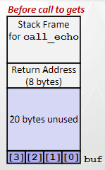
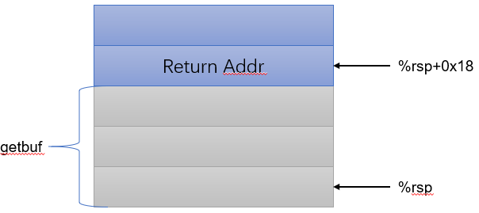
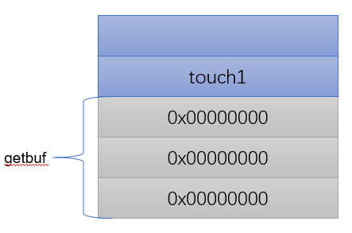
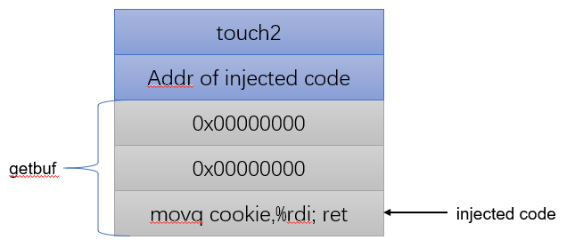
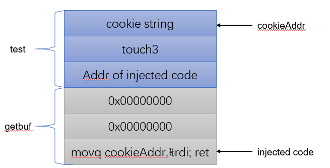
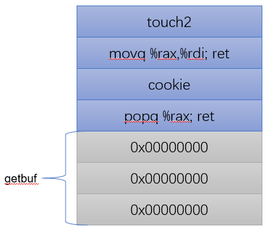
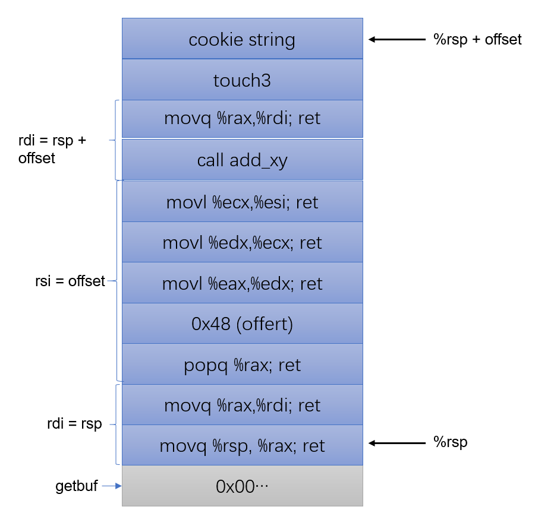

# Attack Lab 实验报告

张鹤潇 2018011365

### 实验目的

- 学习利用缓冲区溢出漏洞来攻击程序的方法；
- 了解编译器和操作系统对抗攻击的方法； 
- 理解 x86-64 架构的堆栈和参数传递机制； 
- 学习使用 gdb 进行调试.

### 实验原理

某些C库函数在读取数据时并不检测缓存区是否溢出，这就给了攻击者注入恶意数据的机会。具体而言，以下图中描述的栈结构为例，攻击者可以借缓存区溢出漏洞修改父栈帧的 Return Address，完成**代码注入攻击**：在栈上注入恶意代码，然后让 Return Address 指向这些代码的首地址。



在现代编译器中，栈地址随机化等保护措施的应用使代码注入攻击难以奏效，然而通过 **ROP 攻击**，仍可以对程序进行破坏。ROP 攻击的思想在于**组合程序原有的代码片段**，以达成攻击者的目的。

在本次实验中，我们将应用以上两种技巧攻击一组用 c 库函数`gets`读入数据的程序。

### 实验过程

前三个实验是对`ctarget`进行代码注入攻击：通过`getbuf`注入攻击代码，使程序分别跳转执行`touch1`, `touch2`和`touch3`等三个函数。

对`getbuf`函数反汇编可知，读入数据的缓存区大小为`0x18`，栈帧示意图如下：



#### Phase 1

欲使`getbuf`返回后跳转执行`touch1`，只需将`Return Addr`覆盖为`touch1`的地址即可，缓存区用0填充。




#### Phase 2

本题要求传递参数`cookie(int)`给函数`touch2`，也就是说，我们需要将`cookie`提前存储到寄存器`rdi`中。



将欲执行代码注入到`getbuf`的栈帧中，并将`Return Addr`覆盖为注入代码的首地址；注入代码执行后，程序将跳转到`Return Addr+0x08`保存的地址处，将这里覆盖为`touch2`的地址即可。

#### Phase 3

本题在 Phase 2 的基础上更近一步，需要将`cookit(char*)`作为参数传递到`touch3`中；也就是说，我们不仅要注入传递参数的代码，还要将`cookie`字符串注入到合适的位置。



考虑到`getbuf`返回后，其栈帧内的数据可能会丢失，我将`cookie`字符串注入到父过程`test`的栈帧中；注入代码段将字符串首地址存入`rdi`，以传递参数。

---

后两个实验在`rtarget`上进行，该程序应用了栈地址随机化等保护手段，使代码注入攻击不能奏效，但攻击者仍可以组合程序自有代码发起 **ROP 攻击**。

#### Phase 4

与 Phase 2 相同，本题需令程序跳转执行`touch2`并传递参数`cookie(int)`, 但要通过ROP攻击实现。



由于我只能使用程序原有代码，欲将`cookie(int)`存入`rdi`，需要先将`cookie`通过弹栈存入`rax`，再将`rax`中的内容存入`rdi`。原程序中对应汇编代码段如下：

```assembly
0000000000401ac2 <addval_363>:  # (4019c4) 58 90 c3: popq %rax; ret
  401ac2:	8d 87 58 90 c3 04    	lea    0x4c39058(%rdi),%eax
  401ac8:	c3                   	retq 

0000000000401abb <setval_364>:  # (401abe) 48 89 c7 c3: movq %rax,%rdi; ret
  401abb:	c7 07 46 48 89 c7    	movl   $0xc7894846,(%rdi)
  401ac1:	c3                   	retq   
```

使程序先后跳转到这两处执行相应语句即可。

#### Phase 5

本题需要用 ROP 攻击使程序跳转执行`touch3`并传递参数`cookie(char*)`。

由于攻击形式的限制，本题的流程颇为复杂。注入字符串的首地址需要通过`Return Addr + Offset`计算获得：先将`getbuf`的返回地址（`%rsp`）存入寄存器`rdi`，再将字符串首地址相对返回地址的偏移量存入`rsi`，调用函数`add_xy`获得字符串首地址，并将之存入`rdi`中以传递参数，最后跳转执行`touch3`即可。



### 总结反思

熟练使用 gdb 对完成实验很有帮助，不过也不需要用到太复杂的功能，只要设置断点，单步执行，并随时查看寄存器即可满足实验需求。

`wsl1`可以正常完成`rtarget`上的两个实验，但无法运行`ctarget`，这与后者对内存的使用方式有关。
