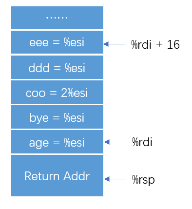
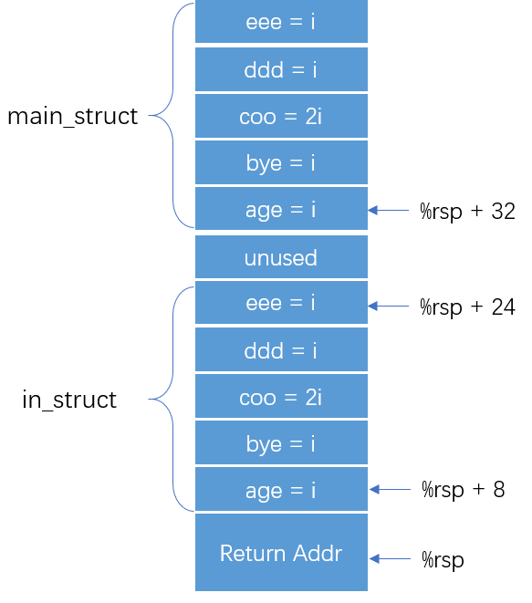

# Homework 3

2018011365 张鹤潇

## 题1.

### 1.1

SET 函数的返回地址为 GET 函数的返回地址，返回值为 1.

### 1.2

A 指令后，%eax 储存输入参数，即存储当前处理器以及栈信息的内存块地址；

B 指令后，%ecx 储存 GET 函数的返回地址；

C 指令将栈顶地址的上一位地址存储到 %ecx 中，在之后 SET 函数中，该地址被赋给%esp;

E 指令将 GET 函数的返回地址压栈，使 SET 函数返回地址为 GET 函数的返回地址；

D 指令：movl 72(%eax), %esp .

## 题2.

### 2.1

save 函数以 `current_ctx` 指针所指位置为首地址，将 %rsp, %rbx, %rbp, %r12, %r13, %14, %r15 ，七个寄存器的状态保存到栈上；load 函数根据输入指针参数读取数据，恢复这些寄存器和 `current_ctx` 的状态。

### 2.2

%rsp 保存着该协程的栈顶信息，另外六个都是**被调用者保存**的寄存器。程序没有保存用于传参和存储返回值的寄存器，因其与当前协程的状态信息无关；也没处理调用者保存寄存器，它们应该由 save/load 函数的调用者保存到栈上。

## 题3.

调用 `return_struct` 函数之前，父过程 `function1` 已经为结构体开辟了栈空间，并将结构体指针和全局变量 `i` 以参数的形式（`%rdi`, `%esi`）传递给函数`return_struct` 。

在`return_struct`中，以 `%rdi` 为首地址的结构体被赋值，示意图如下：

结构体指针通过寄存器`%rdi`在函数间传递。

## 题4.

### 4.1

在 `function2` 中，结构体变量 `main_struct` 及其用于传参的拷贝被保存在栈上。调用 `input_struct`后，栈的示意图如下：

`input_struct` 通过 `%rsp` 来访问结构体参数 `in_struct`。

### 4.2

编译器将 `function2` 中结构体的创建和 `input_struct`的调用都优化掉了，直接返回最终结果 $3i$.

### 4.3

增加 `static` 修饰符后，`input_struct` 仅在该文件内可见，也就是说，它只被 `function2` 所调用。既然 `function2` 可以不调用 `input_struct` 直接返回结果，编译器选择不再生成 `input_struct` 相关代码。