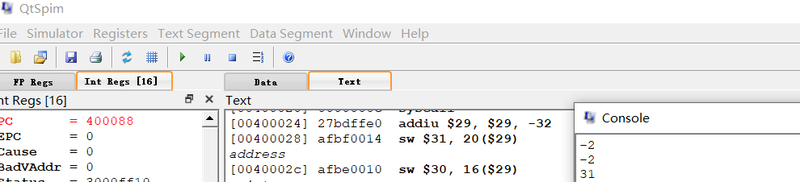

# Homework 4

2018011365 张鹤潇

## 1.

对于输入的`int`型变量，统计其二进制表示中1的个数。用nop规避branch delay slot.

运行成功截图：



```bash
# 输入
-2
# 输出
-2
31	# pcount_r 函数返回值 
```

源代码：

```assembly
.rdata
    newline:
    .asciiz "\n"   

.text
.globl main
main:
    subu        $sp, $sp, 32    # stack frame
    sw          $ra, 20($sp)    # save return address
    sw          $fp, 16($sp)    # save old frame pointer 

    li          $v0, 5          # get input
    syscall
    move	    $v1, $v0		# save input to $v1
    move        $a0, $v0
    li          $v0, 1          # print input
    syscall
    li          $v0, 4
    la          $a0, newline    # print newline
    syscall

    move	    $a0, $v1		# pass parameter x
    jal         pcount_r        
    nop

    move 	    $a0, $v0        # print result
    li          $v0, 1          
    syscall
    li          $v0, 4
    la          $a0, newline    # print newline
    syscall

    lw          $ra, 20($sp)    # restore ret addr
    lw          $fp, 16($sp)    # restore frame pointer
    addiu       $sp, $sp, 32    # pop stack fram

    li          $v0, 10       
    syscall                     # exit
pcount_r:
    subu        $sp, $sp, 32    # stack frame
    sw          $ra, 20($sp)    # save return address
    sw          $fp, 16($sp)    # save old frame pointer
    addiu       $fp, $sp, 28    # set up frame pointer (4 bytes reserved)

    sw          $a0, 0($fp)     # save argumnet x
    lw          $v0, 0($fp)     # load x

    beq         $v0, $zero, $L2    # branch if x == 0
    srl         $a0, $a0, 1     # if x != 0, cal x >> 1
    jal         pcount_r        # call pcount_r
    nop
    lw          $v1, 0($fp)     # load x
    andi        $v1, $v1, 1     # v1 = x & 1
    addu        $v0, $v0, $v1   # return x & 1 + pcount_r(x >> 1)
    jr          $L1             # jump code to return
    nop

$L2:    # if x == 0 then
    li          $v0, 0          # return 0

$L1:
    lw          $ra, 20($sp)    # restore $ra
    lw          $fp, 16($sp)    # restore $fp
    addiu       $sp, $sp, 32    # pop stack
    jr          $ra     
    nop
    
```

## 2.

```
lui $1, 1
addu $1, $1, $sp
lw $t6, 0($1)

lui $1, 0x56
ori $6, $1, 0x3478
```

## 3.

(1).

```bash
buf[0] = 0x64636261
buf[1] = 0x68676665
buf[2] = 0x08040069
```

(2). 

ebp = 0x68676665

(3). 

eip = 0x08040069 

## 4.

1). 是，其地址为 `-4(%ebp)`, `val`必须存储在栈上，因为在递归过程中要传递它的地址。

2). 否。`val2`不必存储在栈上。

3). 由被调用者保存的寄存器`%ebx`存储于 `-24(%exp)`，它在函数开始时以`pushl %ebx` 语句保存，返回前以`-24(%ebp),%ebx`语句恢复。

4). 没有。