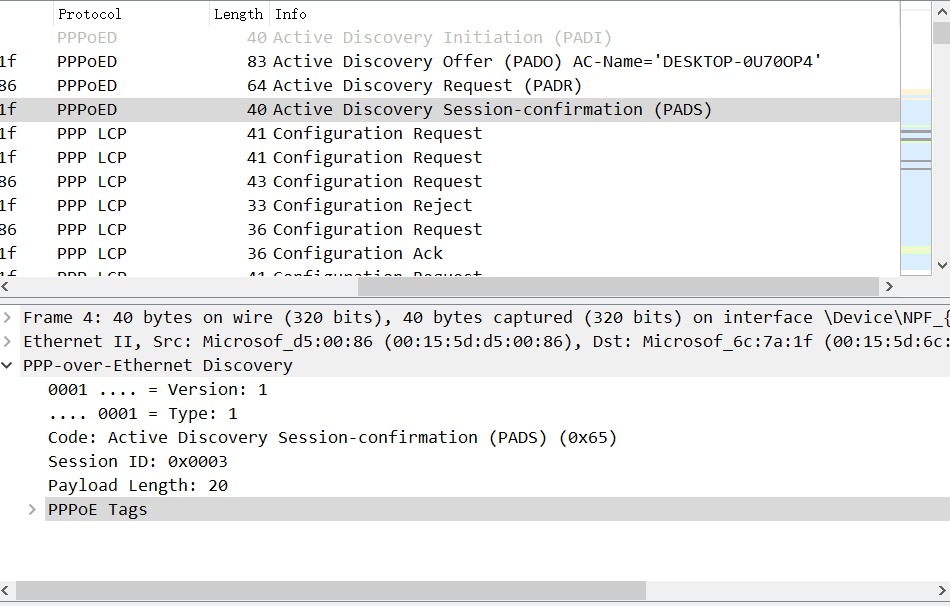
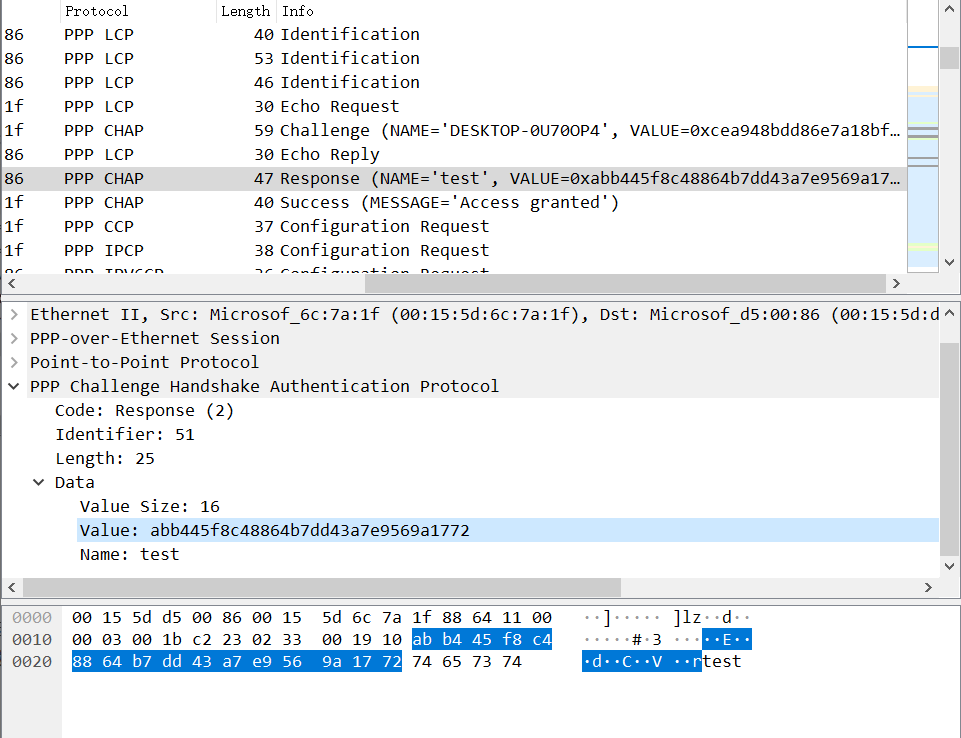
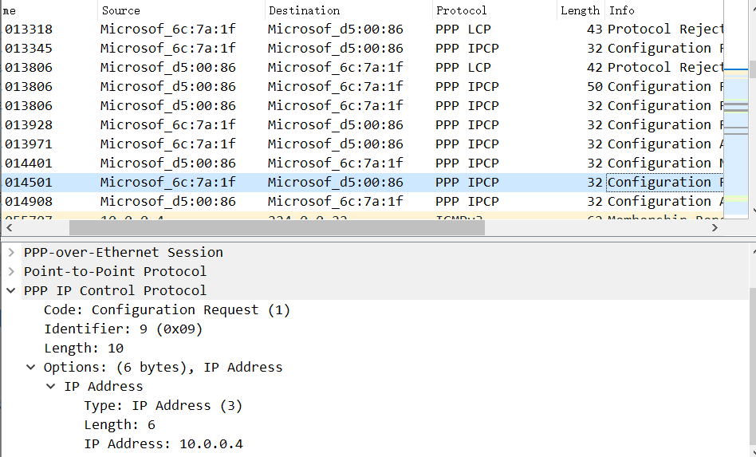

# Homework 3

2018011365 张鹤潇

#### 3.1

需要发送的次数 $X\sim Ge(0.8^{10})$, 平均需要发送
$$
E(X)=1/0.8^{10}\approx9.3
$$

#### 3.2

a. 00000101 01000111 11100011 11100000 01111110

b. 01111110 01000111 11100011 11100000 11100000 11100000 01111110 01111110

c.01111110 01000111 110100011 111000000 011111010 01111110

#### 3.9

由 $m+r+1\le 2^r$, $n=16$, $r$ 可以取 5.

记原序列为$(m_1\cdots m_{16})$，加入校验位后的序列为 $(m'_1\cdots m'_{21})$
$$
\begin{aligned}
m'_1&=\oplus_{i\in\{1,2,4,5,7,9,11,12,14,16\}} m_i=0\\
m'_2&=\oplus_{i\in\{1,3,4,6,7,10,11,13,14\}} m_i=1\\
m'_4&=\oplus_{i\in\{2,3,4,8,9,10,11,15,16\}} m_i=1\\
m'_8&=\oplus_{i\in\{5,6,7,8,9,10,11\}} m_i=1\\
m'_{16}&=\oplus_{i\in\{12,13,14,15,16\}} m_i=1
\end{aligned}
$$
**01**1**1**101**1**0011001**1**10101

#### 3.11

能检出所有1位错误，2位错误。

无法检出所有3位错误，比如某一数据位及其对应的行列校验位都发生错误的情况。

无法检出所有4位错误，比如数据位发生四个错误，且错误分布于一个矩形四角的情况。

#### 3.20

$$
\frac{x/4\ kbps}{x/4\ kbps+20\times2\ ms}\ge0.5\\
x\ge 160\ b
$$

#### 3.21

可能。一种情况是发送方发送帧后收到了 ack 值，且 ack 值与期望值不一致，那它就会重传这一帧，重新开始计时。

#### 3.22

信道延迟 $R=3000\ km \times 6\mu s/km=18\ ms$

每帧发送到应答的时间需要 $2R+\frac{64\ B}{1.544\ Mbps}=36.33\ ms$

在此期间已经发送了 $\frac{36.33\ ms}{0.33\ ms}\approx 110$ 帧数据，需要 7 位长的序号。

#### 3.32

设一次能接受 n 帧数据，因确认帧总是附加在数据帧中，利用率 $\frac{n\times 1000\ b/1\ Mbps}{(1000\ b/1\ Mbps+270\ ms)\times2}=\frac{n}{542}$

1. $n=1$, $\frac{1}{542}=0.18\%$
2. $n=7$, $\frac{7}{542}=1.29\%$
3. $n=4$, $\frac{4}{542}=0.74\%$

## PPPoE协议实验

我以 wsl2 Ubuntu 18.04 作为 server，win10 作为 client 完成实验。

#### 1.

PADS 报文

PPP-CHAP response 报文，加密摘要在图中标出。

PPP-IPCP request 报文

#### 2.

PPP 帧头部的标志字段为 0x7E, 地址域为 0xFF, 控制域为 0x03，在实验中均为确定值。因此 PPPoE 省略了这部分，以提高效率。

#### 3.

> [Reference](https://blog.51cto.com/lihongweibj/1735049)

PPP LCP协商的MRU（Maximum-Receive-Unit 最大接收单元）是针对PPP报文而言，指发送端PPP报文中信息域的长度不能超过MRU，否则接收端不负责处理，可能会将报文丢弃。

在 LCP 协商中，把MTU的配置值作为本端MRU的值与对端协商MRU。最终PPP链路的MTU的取值应该是：MIN（配置MTU，MIN（本端MRU，对端MRU））。因此 MRU 值受到本端和对端的 MRU 配置值影响。

#### 4.

列举如下，

- 可以动态分配IP地址分配方式。
- 支持多种物理层和网络层协议，应用广泛成熟。
- 计费方式灵活，可通过一个PPP会话的建立和释放对用户进行基于时长或流量的统计。
- 可以防止地址冲突和地址盗用，所有 IP 应用数据流均使用相同的会话 ID，保障用户使用 IP 地址的安全。