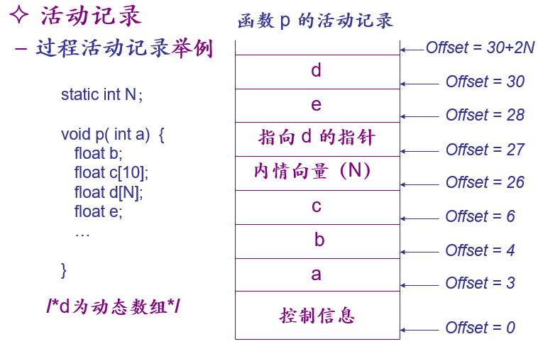

# Report: Step 12

2018011365 张鹤潇 

### 实验过程

Step 12 引入数组和指针算术。

定义数组类型 `ArrayType`，存储数组长度和元素类型。

```python
class ArrayType(MiniType):
    def __init__(self, base: MiniType, length: int):
        super().__init__(f'ArrayType<{length}>')	# 数组必须为右值
        self.base = base
        self.size = length * len(base)

    def __len__(self):
        return self.size

    def __eq__(self, o: object) -> bool:
        return isinstance(o, ArrayType) and self.base == o.base and len(self) == len(o)

    def value_cast(self, target_cat):
        if target_cat == ValueCat.LVALUE:
            raise UnsupportedOperation("Array must be RVALUE.")
        return self
```

增加数组声明语法 `ty IDENT ('[' NUM ']')+ ';'`，访问者函数实现如下，

```python
    def visitLocalArrayDecl(self, ctx: MiniDecafParser.LocalArrayDeclContext):
        name = ctx.IDENT().getText()
        if name in symbol_table[-1]:	# 防止重定义
            raise_error(ctx)
        types = deque()
        types.append(self.visit(ctx.ty()).value_cast(ValueCat.LVALUE))
        for num in reversed(ctx.NUM()):	# 从右到左，生成多维数组类型
            i = int(num.getText())
            if i > INT_MAX or i < INT_MIN:
                raise_error(ctx)
            if i == 0:
                raise_error(ctx)
            types.appendleft(ArrayType(types[0], i))
        ty = types[0]
        self.local_var_cnt += len(ty) // 4
        symbol_table[-1][name] = Symbol(-4 * self.local_var_cnt, ty)

        return NoType()
```

进一步支持数组/指针下标 `[]` 语法 `postfix '[' expr ']'`，访问者函数实现大致如下，

```python
    def visitSubscriptPostfix(self, ctx: MiniDecafParser.SubscriptPostfixContext):
        postfix_ty = self.rcast(self.visit(ctx.postfix()), ctx)	# 检查数组类型
        self.type_check(self.visit(ctx.expr()), ctx, IntType)	# 检查 expr 是否为整形
        ret_ty = None
        if isinstance(postfix_ty, PointerType):
            # ... (生成相应汇编码)
            ret_ty = postfix_ty.dereferenced()	# 返回指针指向数据的类型
        elif isinstance(postfix_ty, ArrayType):
            # ... (生成相应汇编码)
            ret_ty = postfix_ty.base			# 返回数组元素类型
        else:
            raise_error(ctx)
        return ret_ty
```

指针算术包括指针加/减整数、整数加指针、指针减指针，在二元运算访问者函数中添加对应的逻辑判断，生成汇编代码即可。

### 思考题

#### 1.

B:`*(int*)(4096+23*4) `

C: `*(int*)(4096+(2*10+3)*4)`, 

D: `*(int*)((*(int**)(4096+2*4))+3*4)`

E: `*(int*)((*(int**)(4096+2*4))+3*4)`.

#### 2.

VLA的长度不能在编译期间确定，意味着无法确定函数中的局部变量个数，也就无法确定函数的栈帧大小。而程序同时存在 2 个 VLA 时，其中之一的起始地址不能在编译时确定。

为了解决这些问题，可以将 VLA 的长度和起始地址存储在函数栈帧中，在运行时动态调整栈指针为数组开辟空间，函数返回时释放相应内存。如下图，



考虑到无法在 `ArrayType` 中记录 VLA 的长度，编译期间的类型检查也要做调整：增加一个新的类型 `VALType`，记录变长数组元素类型。


### Acknowledgment

相关实现参考了[Java-ANTLR](https://github.com/decaf-lang/minidecaf/tree/md-xxy)

