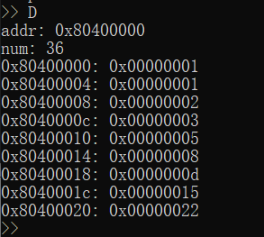
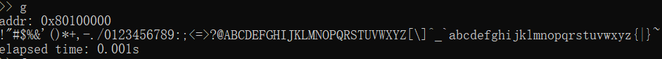
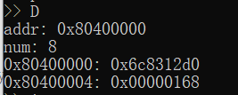

# 实验报告: 熟悉 RISC-V 汇编与监控程序

2018011365 计84 张鹤潇 

## 实验目的

- 熟悉 RISC-V 汇编语言编程
- 熟悉监控程序和终端程序

## 实验内容

阅读监控程序（`Kernal`）源代码，使用模拟器运行监控程序，通过终端（`Term`）连接监控程序，使用RISC-V汇编编写代码，并且在监控程序中运行。

1. 在模拟器中运行 RISC-V监控程序，掌握 Term 中几个命令的使用方法。

2. 编写汇编程序，求前 10 个 Fibonacci 数，将结果保存到起始地址为 0x80400000 的 10 个字中，并用 D 命令检查结果正确性。

3. 编写汇编程序，将 ASCII 可见字符（0x21~0x7F）从终端输出。

4. 编写汇编程序，求第 60 个 Fibonacci 数，将结果保存到起始地址为 0x80400000 的 8 个字节中，并用 D 命令检查结果正确性。

## 实验过程

### 内容2：求前10个Fibonacci数

求第 n 个斐波那契数的高级语言（Python）代码如下

```python
def fib(n: int):
    a, b = 1, 0
    for _ in range(n):
        a, b = a+b, a
    return b
```

将其翻译成 RISC-V 汇编语言，以 `t0`, `t1` 分别存储 `a`, `b`.

```assembly
.section .text
.globl _start
_start:
    li t0, 0x1 # t0, t1 = 1, 0
    li t1, 0x0
    li t3, 0xa
    la t4, 0x80400000
loop:
    mv  t2, t0
    add t0, t1, t0  # t0 = t0 + t1
    mv t1, t2  # t1 = t0
    sw t1, (t4)	# store t0
    add t4, t4, 4
    add t3, t3, -1
    bne t3, x0, loop  # loops 10 times
    jr ra
```

运行结果图：



### 内容3：输出 ASCII 可见字符

本部分的难点在于如何输出字符，有调用 `ecall` 和写串口两种实现方式。

调用 `ecall` 的方法比较简单，但需要更改监控程序的 `make` 选项；写串口需要调用 `util.S` 中的 `WRITE_SERIAL` 函数，我采用了取巧的方法，将该函数的代码直接复制到我的程序中。

```assembly
.section .text
.globl _start
_start:
    li a0, 0x21
    li t2, 0x7E
loop:
# WRITE_SERIAL 函数，源于util.S
WRITE_SERIAL:                       # 写串口：将a0的低八位写入串口
    li t0, 0x10000000   # COM1 =  0x10000000
.TESTW:
    lb t1, %lo(5)(t0)  # 查看串口状态  COM_LSR_OFFSET = 5
    andi t1, t1, 0x20       # 截取写状态位 COM_LSR_THRE = 0x20
    bne t1, zero, .WSERIAL          # 状态位非零可写进入写
    j .TESTW                        # 检测验证，忙等待
.WSERIAL:
    sb a0, %lo(0)(t0)  # 写入寄存器a0中的值
    add a0, a0, 1
    bne a0, t2, loop  # if a0 == 0x7E: break
    jr ra
```

运行结果图：



### 内容4：求第60个 Fibonacci 数

第60个斐波那契数(`0x1686c8312d0`)超出了32位整数的表示范围，需要用2个寄存器保存。我用 `t1|t0`表示下一个斐波那契数，`t3|t2`表示当前斐波那契数，模拟竖式加法进行64位整数加法，用低位相加后**是否发生无符号数溢出**判断进位。

```assembly
.section .text
.globl _start
_start:
    li t0, 0x1 # a = t1 | t0
    li t1, 0x0
    li t2, 0x0 # b = t3 | t2
    li t3, 0x0
    li a0, 0x3c  # the (a0)th num
    la a1, 0x80400000
loop:  # t4 stores temporary variable
    # 高位运算
    mv  t4, t1
    add t1, t1, t3  # t1 = t3 + t1
    mv t3, t4  # t3 = t1
    # 低位运算
    mv t4, t0
    add t0, t0, t2  # t0 = t0 + t2
    bgeu t0, t4, normal	# if t0 < t4, overflow
    add t1, t1, 1  # 进位
normal:
    mv t2, t4  # t2 = t0
    add a0, a0, -1
    bne a0, x0, loop
    # save t3 | t2
    sw t2, (a1)
    sw t3, 0x4(a1)
    jr ra
```

运行结果图：



### 代码分析

#### 终端程序

终端程序启动后，首先解析命令行参数。对使用 TCP 的程序，调用 `InitializeTCP()` 根据 host 和 port 建立 `socket` 连接；对使用 serial 的程序，调用 `InitializeSerial()` 建立串口连接。连接建立后，进⼊ `Main()` 函数开始交互。

在 `Main` 函数中，先打印启动信息，包括欢迎信息 (MONITOR for RISC-V - initialized) 和地址长度；接着循环地从命令行读取指令 `X`  (X = Q, A, F, R, D, U, G, T)，若 `X = Q`，则结束程序，否则调用函数 `run_X()`进行处理。

`run_A()` 负责从命令行读入用户代码。它调用 `multi_line_sam()` 函数检查输入的合法性，将输入汇编代码转换成二进制机器指令后, 按 4 字节分段，连同操作符 'A'、地址、地址长度发送给 `kernal` 。

`run_F()` 负责从文件读入用户代码，除输入流外与`run_A()`基本一致。

`run_R()` 负责打印寄存器状态。它向 kernel 发送操作符 'R' 后，读取所有寄存器的值，并将其输出到屏幕。

`run_D()` 负责打印内存状态。它首先检查对齐，之后向 kernel 发送指令 'D'、起始地址和读取长度，每次四字节地从 kernel 读取数据并输出到屏幕。

`run_U()` 负责打印内存中的汇编代码。它在`run_D`的基础上调用`single_line_disassmble()`将读取到的二进制机器指令反汇编后输出到屏幕。

`run_G` 负责运行用户程序。它首先向 kernal 发送操作符 'G' 和程序起始地址，接收`start mark(0x6)`后开始计时，接收到`finish mark (0x7)`后，结束计时，打印程序运行时间。若在此期间接收到`exception mark (0x80)`，则用户程序触发了异常，读取异常信息并打印到屏幕。

`run_T` 负责打印页表，不在实验范围内。

#### 监控程序

监控程序 `kernal` 的源代码包括 `kernel/kern` 文件夹下的汇编和C++文件。本实验相关功能主要在 `init.S`,`shell.S`,`utils.S`, `Trap.S` 中。

`init.S` 中定义了程序入口 `START` , 在此初始化 BSS，内核栈，用户栈，异常处理，串口，线程等资源，之后进入 `WELCOME` 函数，打印欢迎信息 (MONITOR for RISC-V - initialized) 后进入 `shell.S` 中的 `SHELL` 函数开始交互。

`SHELL` 循环地调⽤ `READ_SERIAL` 读操作符 `X` (X = R, D, A, G, T )，若操作符错误，则向终端发送地址长度 ，否则进入 `.OP_X` 处理指令。`.OP_X` 与终端程序中的 `run_X()`是相对应的。

`.OP_A` 负责读入用户程序。先读取指令地址和长度，然后循环地从串口读取字 (4 bytes) 写入内存中。

`.OP_R` 负责读取寄存器状态。它将存储寄存器的内存段 uregs 每次⼀字节地写⼊串⼝。

`.OP_D` 负责打印内存状态。它先读取内存地址和长度，然后每次⼀字节地写⼊串⼝。

`.OP_G` 负责运行用户程序。它先读取起始地址，然后向终端程序发送`start mark(0x6)`. 从保存用户寄存器的内存段`uregs`读取各个寄存器的值，并设置返回地址，之后跳转到用户代码段开始执行用户程序；用户程序返回后，将寄存器状态存储回内存，向终端程序发送`finish mark (0x7)`.  异常处理的部分在 `Trap.S` 中完成。

`.OP_T` 负责打印页表，不在实验范围内。

## 思考题

**比较 RISC-V 与 x86 指令寻址方法的异同。**

相同点：都是通过寄存器+立即数的模式寻址。

不同点：RISC-V 支持的立即数短，除 jal ⽀持 20 位⽴即数寻址外，其他都是12位；x86支持的立即数多达 32 位。 RISC-V 只支持 `reg + offset`模式的寻址，x86 支持 `Reg[Rb] + S * Reg[Ri] + D` 及其各种简化版本；RISC-V 只能通过 load/save 指令访存，x86 访存非常灵活。

**根据自己的理解对用到的指令进行分类，并说明分类原因。**

1. 访存指令：包括 `sw`, `sb`, `lw`, `lb`, `lui` 等，该类指令会读写内存。
2. 运算指令：包括 `addi`, `add`, `and`, `andi`, `or`, `ori`, `li`, ` sltu` 等，该类指令对寄存器的值进行运算，不访存，不跳转。
3. 跳转指令：包括 `bne`, `beqz`, `jr`, `jalr` 等，该类指令会造成跳转。

**结合term源代码和kernel源代码说明，term是如何实现用户程序计时的。**

相关代码位于`term.py`的`run_G()`和`shell.S`的`OP_G`中。

开始执行用户程序时，kernal 向 term 发送开始计时信号 (0x6),

```assembly
    ori a0, zero, TIMERSET          # 写TIMERSET(0x06)信号
    jal WRITE_SERIAL                # 告诉终端用户程序开始运行
```

term 接受信号，启动计时，

```python
	if ret != b'\x06':
            print("start mark should be 0x06")
     time_start = timer()
```

用户程序返回后，kernal 发送结束信号 (0x7)，

```assembly
    ori a0, zero, TIMETOKEN         # 发送TIMETOKEN(0x07)信号
    jal WRITE_SERIAL                # 告诉终端用户程序结束运行
```

term 接收信号，结束计时并打印结果。

```python
	while True:
    	ret = inp.read(1)
      	if ret == b'\x07':
      		break
        # ......
	print('elapsed time: %.3fs' % (elapse))
```

**说明kernel是如何使用串口的（在源代码中，这部分有针对FPGA与QEMU两个版本的代码，任选其一进行分析即可）。**

相关代码位于 `utils.S` 中。

`WRITE_SERIAL` 用于写入 1 字节数据。它首先检测串口是否可写，如果不可写则忙等待 (无限循环)，直到可写后，将参数`a0`的低八位写入串口。

忙等待可能是一启动监控程序，我的电脑风扇就开始加速运转的原因。

`WRITE_SERIAL_WORD` 重复调用 `WRITE_SERIAL` 实现写入 1 字数据。

`WRITE_SERIAL_XLEN` 根据程序是 64 位还是32 位调用 1 次或 2 次`WRITE_SERIAL_WORD` 写入`XLEN` 字节数据。

`READ_SERIAL` 负责读入 1 字节数据，与 `WRITE_SERIAL` 逻辑相同。

`READ_SERIAL_WORD` 调⽤四次 `READ_SERIAL` ，将结果分别放⼊ s0, s1, s2, s3四个寄存器中， 然后再将这四个值截取低8位后从低到高存⼊ a0 寄存器返回。`READ_SERIAL_XLEN` 和 `WRITE_SERIAL_XLEN` 类似.

**请问term如何检查kernel已经正确连入，并分别指出检查代码在term与kernel源码中的位置。**

term:

- 使用 TCP 连接的相关代码位于 `InitializeTCP()` 中。先用正则表达式获取 host 和 port，然后建立 socket 连接，该过程中的异常处理由 `socket` 库负责完成。

  ```python
   	# tcp_wrapper.connect
      def connect(self, host, port):
   		self.sock.connect((host, port))
  
   	# ser : tcp_wrapper
      ser.connect(host, int(port))
  ```

  读写 `socket` 时检测读写长度，若读写内容为空则抛出异常。

  ```python
      # tcp_wrapper.read 
      while bytes_recd < MSGLEN:
      	chunk = self.sock.recv(min(MSGLEN - bytes_recd, 2048))
           if chunk == b'':
           	raise RuntimeError("socket connection broken")
              
      # tcp_wrapper.write
      while totalsent < MSGLEN:
      	sent = self.sock.send(msg[totalsent:])
      	if sent == 0:
          	raise RuntimeError("socket connection broken")
  ```
  
- 使用 serial 连接的相关代码位于 `InitializeSerial` 中，异常处理由`pyserial`库负责，如果连接失败，会抛出 `SerialException`.

  ```python
  	tty = serial.Serial(port=pipe_path, baudrate=baudrate)
  ```

kernel:

监控程序读写串口时，通过状态位判断是否能进行读写，相关原理在上一道思考题中已详述。

```assembly
WRITE_SERIAL:                       # 写串口：将a0的低八位写入串口
    li t0, COM1
.TESTW:
    lb t1, %lo(COM_LSR_OFFSET)(t0)  # 查看串口状态
    andi t1, t1, COM_LSR_THRE       # 截取写状态位
    bne t1, zero, .WSERIAL          # 状态位非零可写进入写
    j .TESTW                        # 检测验证，忙等待
.WSERIAL:
    sb a0, %lo(COM_THR_OFFSET)(t0)  # 写入寄存器a0中的值
    jr ra
    
READ_SERIAL:                        # 读串口：将读到的数据写入a0低八位
    li t0, COM1
.TESTR:
    lb t1, %lo(COM_LSR_OFFSET)(t0)
    andi t1, t1, COM_LSR_DR         # 截取读状态位
    bne t1, zero, .RSERIAL          # 状态位非零可读进入读
    j .TESTR                        # 检测验证
.RSERIAL:
    lb a0, %lo(COM_RBR_OFFSET)(t0)
    jr ra
```

