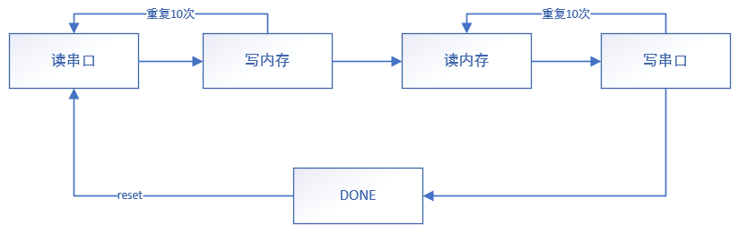

# 实验报告：SRAM 和 UART 串口实验

2018011365 张鹤潇

### 实验思路

仿照 uart 示例代码进行模块化设计，用一个主控状态机控制 `sram_io` 和 `uart_io` 模块的行为。
主控状态机设计如下，



每一个状态 `OP` 包含两个子状态，`OP` 和 `OP_BEGIN`，其功能伪代码如下：

```verilog
OP_BEGIN: begin
	相应模块使能端有效;
    state <= OP;
end
OP: begin
    if (done) begin
        相应模块使能端无效;
        state <= NEXT_OP_BEGIN;
    end
end
```

在 `OP_BEGIN` 中，相应子模块的使能端被置为有效，子模块开始运行；在 `OP` 中，主状态机接收子模块运行完毕的信号，将相应使能端关闭，进行下一步操作。

`sram_io` 和 `uart_io` 基本复用了示例代码的设计。需要注意在读写数据后，将 `data_z` 拉高，以解除对数据总线的占用——示例代码没有体现这一点。

### 实验结果


### 思考题

**静态存储器的读和写各有什么特点？**

SRAM的读写是异步的，需要提前让地址信号稳定下来再拉低对应的控制信号，数据在一段延迟后准备好。

**什么是 RAM 芯片输出的高阻态？它的作用是什么？**

高阻态相当于开路，对其他电路无影响。RAM芯片设置为高阻态表明其目前不占用数据总线，不影响其他设备（如串口）的数据交换。

**本实验完成的是将 Base_RAM 和 Ext_RAM 作为独立的存储器单独进行访问的功能。如果希望将 Base_RAM 和 Ext_RAM 作为一个统一的 64 位数据的存储器进行访问，该如何进行？**

让两片32位RAM共享同样的地址信号、片选使能、读写使能，将二者的字节使能和数据线并置在一起。

**请总结教学机上的 UART 和普通的串口芯片 8251 的异同点？**

相同点：他们都是串行数据接口，进行数据读写的基本逻辑相同。

不同点：串口芯片8251是可以编程的，教学机的UART是不可编程的。

**如果要求将 PC 端发送过来的数据存入到 Base_RAM 的某个单元，然后从该单元中读出，再加 1 送回到 PC 端，则代码需要进行怎样的修改？**

将一个循环分为读串口、写内存、读内存、写串口四个独立的部分，从内存读出的数据加一写回串口。