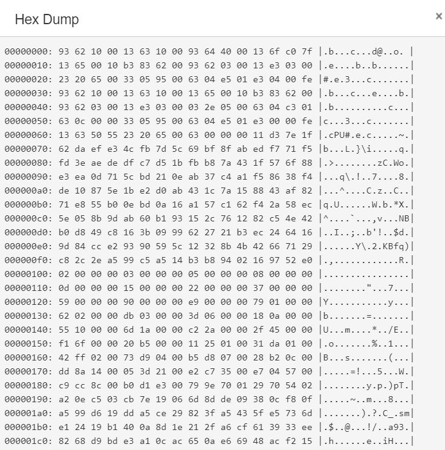

# 实验报告：简单多周期 CPU 实验

2018011365

### 实验思路

本次实验需要实现 RISC-V 的五条机器指令：LW, SW, ADD, ORI, BEQ. 其中 ADD 是 R 型指令，ORI 和 LW 是 I 型指令，SW 是 S 型指令，BEQ 是 B 型指令。因为这五条指令的 opcode 互不相同，所以我用opcode 直接控制状态机的行为。

操纵 CPU 用多个周期完成取指，译码，执行，访存和写回操作。详述如下：

- IF(取指): 复用上一次实验实现的 SRAM 模块，用多个周期读取 `pc[21:2]` 处的指令。
- ID(译码): 分析指令，取出 rs1, rs2, rd, imm 等参数，其中前三个寄存器标识在 RISC-V 指令中的位置是固定的，imm 需要按照指令类型做特殊处理。
- EXE(执行): 计算 ALU 的输出 `alu_res`，更新 pc。BEQ 指令到此即执行结束。
- MEM(访存): LW 和 SW 需要这一步。调用 SRAM 模块用多个周期读写 `alu_res[21:2]` 处的数据。
- WB(写回): 将之前计算/读取得到的数据存入目的寄存器`rd`。

以此为依据设计状态机。

### 数据记录



### 思考题

**指令同样被分为 5 个执行阶段，多周期相比于流水线的不同地方在哪里？**

多周期CPU每条指令每个阶段串行执行，而流水线CPU中不同指令的不同执行阶段并行执行。故流水线CPU在程序运行效率、资源利用效率等方面都优于串行的多周期CPU；但同时，流水线CPU需要缓存每一阶段的执行结果，为了应对各种冲突需要实现各种调度和应对方法，在设计上更加复杂。

**在实验过程中遇到的问题及其解决？**

首先是要将 `uart` 信号 disable 掉。

```verilog
// disable uart
assign uart_rdn = 1'b1;
assign uart_wrn = 1'b1;
```

其次，写回时不能更改零号寄存器。

```verilog
STATE_WB: begin
    if (rd == REG_ZERO) begin
        state <= STATE_IDLE;
    end
    // ...
end
```
