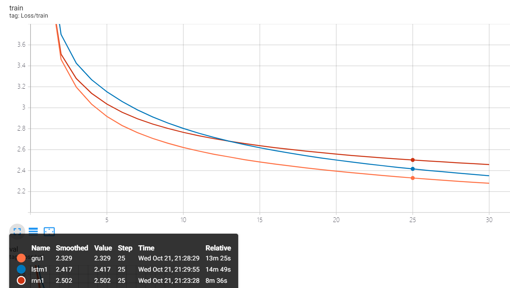

# Report: Text Generation with RNN

2018011365 张鹤潇

## 实验内容

本次实验中，我用 `pytorch` 实现了 RNN，GRU 和 LSTM 的基本单元，并用其搭建 RNN，以随机采样和 Top-p decoding 两种策略进行文本生成。

网络架构如下：

| Model  | \# Recurrent Layers | RNN Unit |
| ------ | ------------------- | -------- |
| RNN_1  | 1                   | RNN      |
| LSTM_1 | 1                   | LSTM     |
| GRU_1  | 1                   | GRU      |
| GRU_2  | 2                   | GRU      |

## 实验结果与分析

#### RNN Cells 的影响

##### Training Loss



##### Val Loss


在测试集上，选取 Decoding Strategy 为 random,  temperature = 1，结果如下：

| Model  | PPL       | Forward BLEU | Backward BLEU | Harmonic BLEU |
| ------ | --------- | ------------ | ------------- | ------------- |
| RNN_1  | 23.61     | 0.281        | **0.316**     | **0.298**     |
| LSTM_1 | 19.44     | **0.287**    | 0.305         | 0.296         |
| GRU_1  | **19.00** | 0.283        | 0.312         | 0.297         |

GRU 的 perplexity 最佳，LSTM 次之，二者在这个指标上明显优于 RNN. 在选定的 Decoding Strategy 下，三种 RNN Cell 的 BLEU 评分相当，没有哪种模型有明显优势。

#### 网络层数的影响

##### Training Loss


##### Val Loss


在测试集上，选取 Decoding Strategy 为 random,  temperature = 1，结果如下：

| Model | PPL       | Forward BLEU | Backward BLEU | Harmonic BLEU |
| ----- | --------- | ------------ | ------------- | ------------- |
| GRU_1 | **19.00** | 0.283        | **0.312**     | **0.297**     |
| GRU_2 | 19.15     | **0.286**    | 0.298         | 0.292         |

实验表明，两层 RNN 并没有带来比单层 RNN 更好的性能，反而加剧了过拟合，使得模型在测试集上的表现略有下降。

#### Decoding 策略的影响

对于性能最好的 GRU_1 模型，调整 Decoding Strategy 和 temperature，测试结果如下：

| Strategy      | temperature | PPL | Forward BLEU | Backward BLEU | Harmonic BLEU |
| ------------- | ----------- | ---- | ---- | ---- | ---- |
| random        | 1           | 19.00  | 0.298      | 0.311    | 0.304  |
| random        | 0.8         | 19.00 | 0.436 | 0.336 | 0.379 |
| top-p (p=0.8) | 1           | 19.00 | 0.438 | **0.337** | 0.380 |
| top-p (p=0.8) | 0.8         | 19.00 | **0.595** | 0.301 | **0.399** |

实际上，随机采样相当于 $p=1$ 时的 top-p decoding，而更低的 temperature 意味着输出层数值较大的单元会更有可能被选中。实验表明，单独降低 p 或者 temperature 都能提高模型的所有 BLEU 评分；而同时同时降低 p 和 temperature 能大幅提高 Forward BLEU，但会降低 Backward BLEU.

##### 结果分析

random, temperature = 1

```reStructuredText
A red fire sitting atop a chain lined landscape area.
The man is standing in the direction of the window.
Black cat sits on a grass covered slab in this big giraffe walking through the sand.
A car, a parking terminal Big are lined up.
A white and red fire hydrant sitting next to a building.
An adult passenger flies through a body of air.
A car that has been placed to a grassy road.
An assortment of handled desktop that is holding letting.
A table that have heads on two cement in the bike.
A group of people sitting on a lush green green tree.
```

大部分句子都有程度不一的语法错误，语义上也是一片混乱，只有 `The man is standing in the direction of the window` 看起来还比较正常。

random, temperature = 0.8

```
A close up of a small hook on a desk.
A bathroom is seen through the counter of a doorway.
A group of giraffe walking together on the wall of a zoo.
A black and white cat looking at positioned in a bathroom.
A plane flies through the air on a cloudy day.
A man in a gazebo in front of a fire hydrant.
A double decker airplane is flying through the sky.
A man in a small leather jacket and standing in a parking lot.
A person that is walking on a skateboard next to some people on a motorcycle.
An airplane flying low against the sky with a blue sky.
```

比上一组句子流畅了一些——这与 Forward BLEU 得分的提高一致——但语法错误和语义混乱仍普遍存在，只有 `A plane flies through the air on a cloudy day` 还说的过去。

top-p, temperature = 1

```
A woman on a red motorcycle at a place of an animal.
A man sitting on a bench in the woods of a dirt field.
A couple of cars parked on the side of a street.
A small aircraft on a runway with a herd of horses.
A motorcycle sitting on the ground at a line of traffic lights.
The older cars are flying through the sky over a plane.
A park bench with three green flowers and a rocky trail.
A white plane flying over a small plane with a lot of small.
A group of people standing on a yellow street surrounded by trees.
A cat sits on top of a bathroom with a laptop computer.
```

与上一组的表现差不多。

top-p, temperature = 0.8

```
A small bathroom with a tub, toilet, and a toilet.
A blue and black jet is on the runway at the airport.
A woman riding a motorcycle on a dirt road near a motorcycle.
A kitchen with a sink, island and a stove top oven.
A group of giraffes standing in the middle of a small small bathroom.
A car is parked on a parking lot in front of a building.
A man with a backpack standing next to a fire hydrant.
A large airplane is on the tarmac at an airport.
A man in a wetsuit is sitting in a kitchen.
A couple of cows and a sheep standing in a field.
```

这一组句子是最流畅的，语法错误最少，语义上也最符合常识。这与 Forward BLEU 大幅提高一致。

四组解码策略对应的 PPL 是相同的，Backward BLEU 虽然有差异，但对于生成结果多样性的影响并不明显， Forward BLEU 与 Harmonic BLEU 得分最高的第四种策略生成的句子质量最好。

#### 词向量的影响

对于 GRU_1, 以如下三种策略使用词向量：

- random：随机初始化，在训练中调整；
- static：以预训练词向量初始化，在训练中固定，这是在之前的实验中使用的策略。
- dynamic：以预训练词向量初始化，在训练中调整。

##### Training Loss


##### Val Loss


动态调整词向量加强了模型的拟合能力，也导致过拟合更容易发生。

在测试集上，选取 Decoding Strategy 为 random,  temperature = 1，结果如下：

| Embedding | PPL       | Forward BLEU | Backward BLEU | Harmonic BLEU |
| --------- | --------- | ------------ | ------------- | ------------- |
| random    | 19.76     | 0.284        | 0.310         | 0.296         |
| static    | 19.00 | 0.283        | 0.312     | 0.297         |
| dynamic   | **18.65** | **0.298** | **0.318** | **0.308** |

实验表明，在该数据集上，用 dynamic 策略调整词向量能得到最优测试性能。 

### 最终模型

超参数设置如下：

| RNN Type           | GRU             |
| ------------------ | --------------- |
| Layers             | 1               |
| Embedding Strategy | dynamic         |
| Decoding Strategy  | top-p (p=0.8)   |
| Temperature        | 0.8             |
| Epochs             | 30              |
| Batch Size         | 32 (default)    |
| Learning Rate      | 0.001 (default) |
| Embedding Units    | 300 (default)   |
| RNN Units          | 64 (default)    |

最终测试性能如下，

| PPL   | Forward BLEU | Backward BLEU | Harmonic BLEU |
| ----- | ------------ | ------------- | ------------- |
| 18.65 | 0.585        | 0.309         | 0.404         |