# Report: Image Generation with VAE and GAN

2018011365 张鹤潇

## 实验内容

在本次实验中，我实现了 VAE，GAN 的模型结构和损失函数，并将其应用到 MNIST 数据集上生成手写数字，测试模型的性能。

模型设置如下：

| Model   | latent dim |
| ------- | ---------- |
| VAE_3   | 3          |
| VAE_10  | 10         |
| VAE_100 | 100        |
| GAN     | 100        |

其它超参数与提供框架保持一致，包括  `batch_size=32`, `num_training_steps=25000`.

## 实验结果与分析

### VAE

#### 训练曲线

##### Training set

| Types           | Curves                                                         |
| -------------- | ------------------------------------------------------------ |
| KL Divergence  | 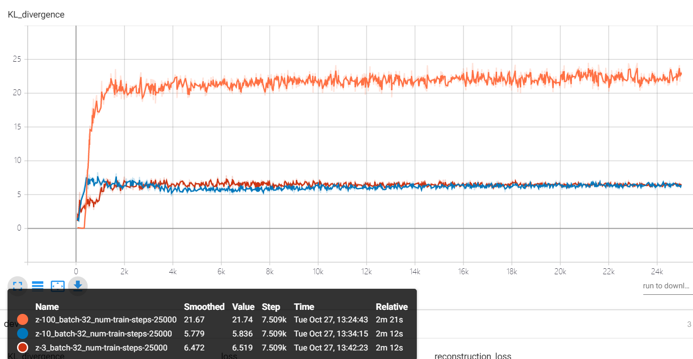 |
| Reconstruction Loss | 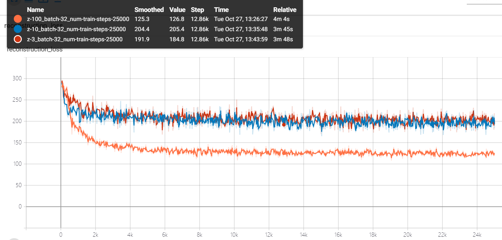 |
|       Loss          | 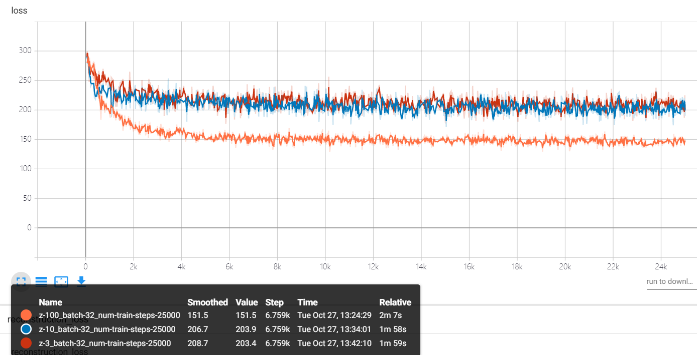 |

##### Dev set

| Types           | Curves                                                         |
| -------------- | ------------------------------------------------------------ |
| KL Divergence  | 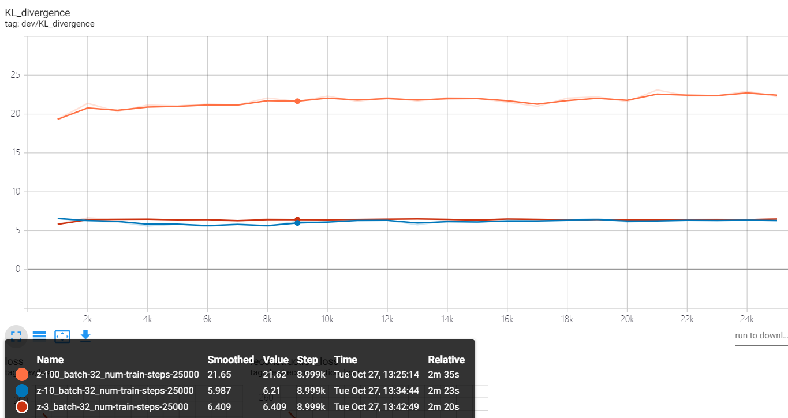 |
| Reconstruction Loss | 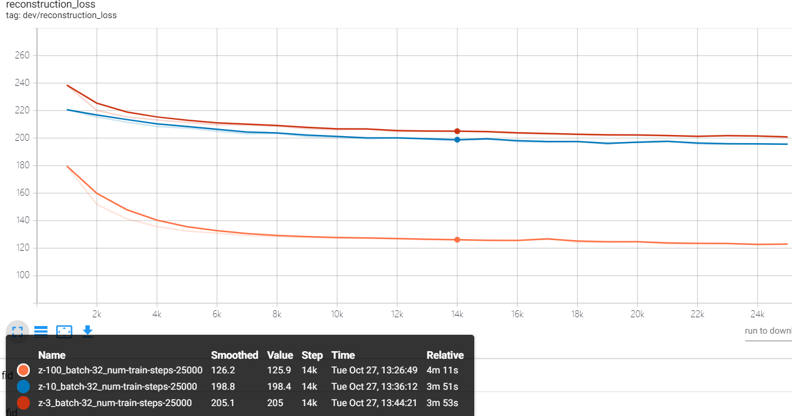 |
|       Loss          | 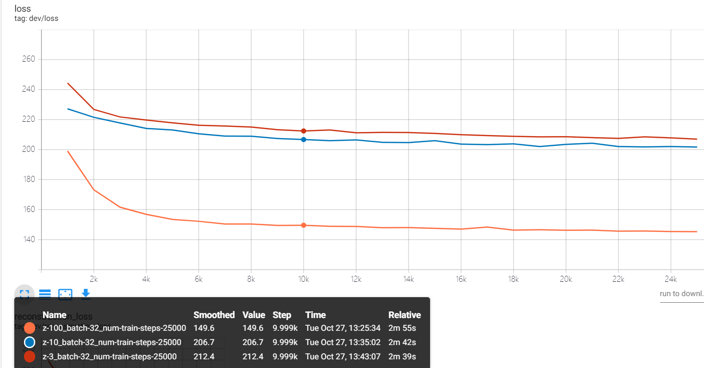 |

#### 生成图像

| Model   | 验证集图像                                         | 重构图像                                                     | 生成图像                                         |
| ------- | -------------------------------------------------- | ------------------------------------------------------------ | ------------------------------------------------ |
| VAE_3   | 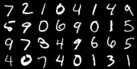               | 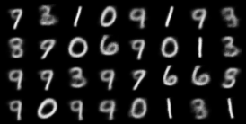           | 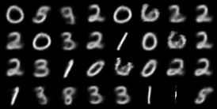               |
| VAE_10  |  | 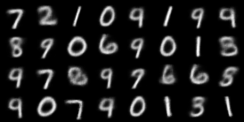 | 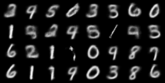 |
| VAE_100 |  | 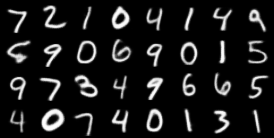 | 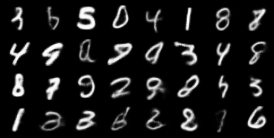 |

#### 测试结果

| Model   | Fid Score |
| ------- | --------- |
| VAE_3   | 102.1     |
| VAE_10  | 95.49     |
| VAE_100 | **26.21** |

##### 隐变量维数对 VAE 的影响

从3，10到100，随着隐变量维数的增加，VAE 重构输入信息的能力逐渐增强，重构 Loss 和 总 Loss 降低，Fid Score 相应提高，生成的图像也变得更清晰和真实，而 KL Divergence 则逐渐变大。

### GAN

#### 训练曲线

| Types              | Curves                                                       |
| ------------------ | ------------------------------------------------------------ |
| Discriminator Loss | 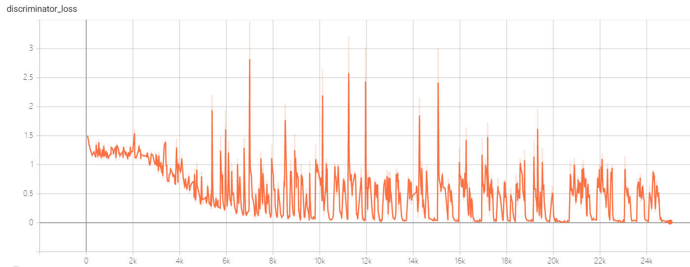 |
| Generator Loss     | 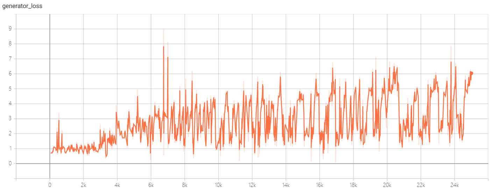 |
| $D(x)$             | 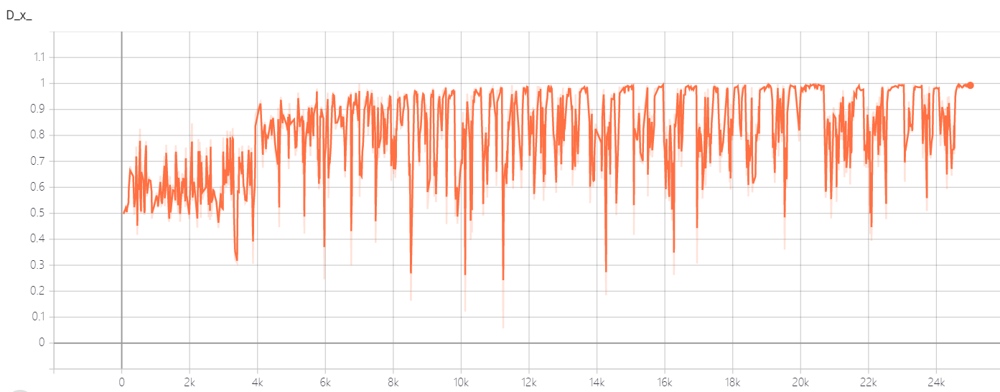 |
| $D_{before}(G(z))$ | 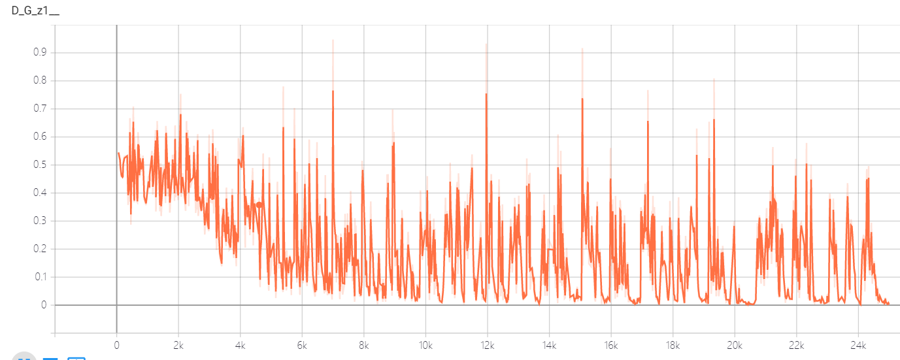 |
| $D_{after}(G(z))$  | 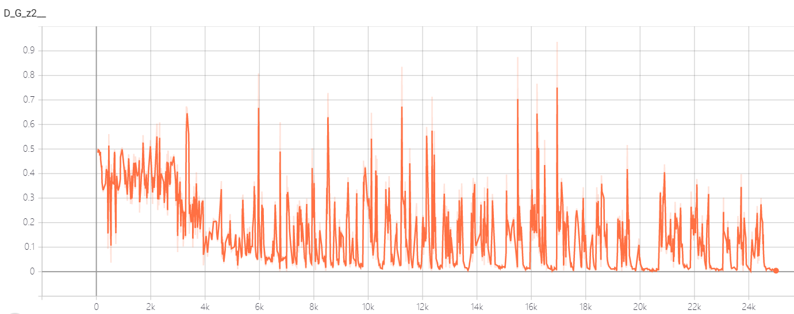 |

#### 生成图像

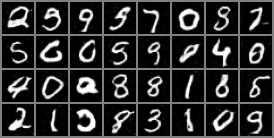

#### 测试结果

| Model   | Fid Score |
| ------- | --------- |
| GAN   | 74.63     |

##### GAN 是否达到了纳什均衡状态？

检查 Loss 曲线和 $D(G(z))$ 曲线，可以推断 GAN 尚未达到纳什均衡状态，因为 Loss 和 $D(G(z))$ 的值还在剧烈变化中，Generator 和 Discriminator 仍处于 “博弈” 状态。

### VAE_100 与 GAN 的比较

比较 VAE_100 与 GAN 生成的图像，可以发现前者的较模糊，后者的较清晰。从两种模型的 objective 出发解释如下。

VAE 的目标是学得从输入数据到一个服从标准正态分布的隐空间向量的映射，以及从这个隐空间到输入空间的映射。这样从正态分布的隐空间采样，就能生成输入空间的样本。然而，有些图像细节很难在低维空间中表示。因此，VAE 难以还原图像的细节，看上去缺乏真实感。

与 VAE 不同，GAN 试图直接学习从隐空间到数据空间的映射，它达到这个目标的方法是对抗。在对抗训练中，Discriminator 从训练集中学到了真实图像细节信息的分布，这迫使 Generator 也学会了这些分布，这样就产生了更清晰，细节更充分的图像。