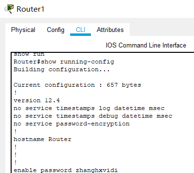

# 网络搭建及路由配置 实验报告

2018011365 张鹤潇

### 任务1

- Router3 端口1与 Router2 连接，IP配置为 10.0.2.1.
- Server1 端口1的网关应该与 PC1 相同，为 192.168.1.1.
- Router2 端口2不应使用20开头的公网IP，应配置为 10.0.2.2.

### 任务2

铺设成果图如下，

给 Router1 增加一块 NM-1FE-TX 扩展，按照网络拓扑草图放置设备，配置每个设备的IP、子网掩码、默认网关，以 Router1 为例，配置如图：

连接各个设备。注意路由器间应使用交叉线来连接，其他设备间应使用直连线连接。配置完成后，子网内部设备可以互相 ping 通，以 PC2 为例，

### 任务3

凯撒的密码明文是“VENI, VIDI, VICI”，即“我来，我见，我征服”。

在 Router1 上设置用户模式口令 password1 为 `zhanghxveni`,  用户模式进入特权模式口令 password2 为 `zhanghxvidi`，通过 talnet 登录口令 password3 为 `zhanghxvici`. 结果如图，

逐个验证，密码确实生效了。

如果配置文件泄露了，明文存储在配置文件中的密码就会丢失。应当使用命令 `service password-encryption`, 使密码以密文形式存储。

对于攻击者暴力破解需要的时间分析如下，

1. $10^6$
2. $36^6=2.2\times 10^9$
3. $62^6=5.7\times 10^{10}$
4. $62^8=2.2\times 10^{14}$

### 任务4

配置每个路由器的静态路由，以 Router1 为例，添加其到 192.168.2.0/24，192.168.3.0/24，10.0.2.0/24 的静态路由。

配置完成后，以 PC1 ping 192.168.3.1，验证成功：

以 Router1 ping Router3：

### 任务5

凯撒的观点存在问题。RIP 协议计算的跳数是在路由器上转发的次数，在子网内部发送使用的是广播，不会计算在跳数里面；凯撒的结论是对的，但是理由存在问题。

在当前网络结构中可以使用 RIP。

选用 RIP 协议，配置各台路由器。以 Router1 为例，

以 PC1 ping 192.168.2.1，验证配置成功，

## Bonus 任务

### 1

对于 Router1，在特权模式下输入 `enable secret 123`，查看配置文件，可以看到加密后的 secret 指令。查阅资料知它是通过 MD5 存储的。

### 2

在任务 4 中，我配置静态路由后第一次发起 ping 测试，以 Router3 ping Router1，出现了丢包现象。

在 ping 命令发起后，数据链路层会在封装之前检查目的 ip 是否在本地的 ARP 缓存中。如果不在，就会发送请求，以获取目标 MAC 地址，建立 ip 地址和 Mac 地址之间的对应，并丢弃这个包。这就引发了丢包现象。