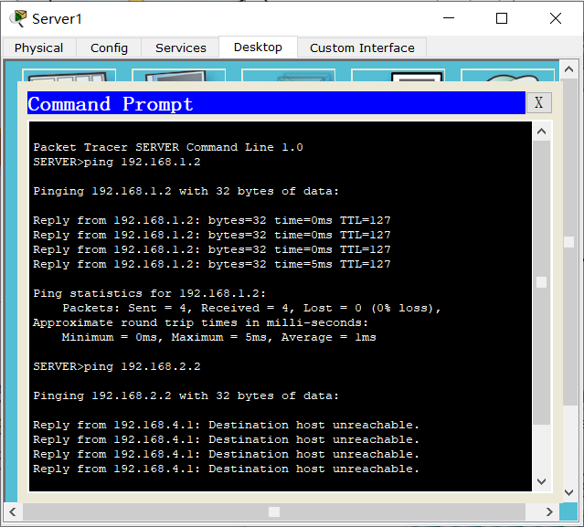
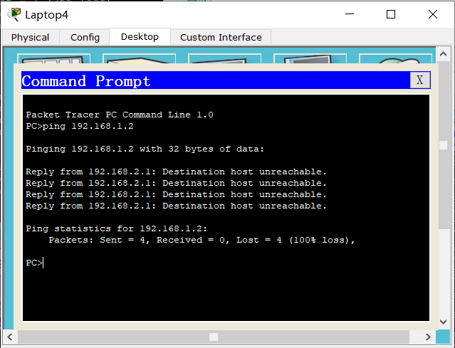

# 访问控制及VPN技术 实验报告

2018011365 张鹤潇

在上次实验完成的网络拓扑和路由协议基础上，配置新增设备，如下图。


### 任务 6

**需求 1** 同一子网内的设备可以互相交流，不需要特殊配置。

**需求 2/3** 在各路由器连接子网的端口配置 ACL。在出方向设置 `access-list number = 101`, 入方向设置 `access-list number = 102`.

- 在出方向，只允许目的 IP 为本子网联络人，或源 IP 为其它子网联络人、或目的 IP 为本部门领导人，源 IP 为其它部门领导人的包进入子网。

  以 Router2 为例，

  ```
  access-list 101 permit ip 192.168.1.2 0.0.0.0 192.168.2.3 0.0.0.0
  access-list 101 permit ip 192.168.3.2 0.0.0.0 192.168.2.3 0.0.0.0
  access-list 101 permit ip 192.168.1.0 0.0.0.255 192.168.2.2 0.0.0.0
  access-list 101 permit ip 192.168.3.0 0.0.0.255 192.168.2.2 0.0.0.0
  access-list 101 permit ip 192.168.1.4 0.0.0.0 192.168.2.0 0.0.0.255
  access-list 101 permit ip 192.168.3.3 0.0.0.0 192.168.2.0 0.0.0.255
  ```

- 在入方向，只允许目的 IP 为其它部门联络人、或源 IP 为本部门联络人、或目的 IP 为其它部门领导人，源 IP 为本部门领导人的包离开子网。

  仍以 Router2 为例，

  ```
  access-list 102 permit ip 192.168.2.3 0.0.0.0 192.168.1.2 0.0.0.0
  access-list 102 permit ip 192.168.2.3 0.0.0.0 192.168.3.2 0.0.0.0
  access-list 102 permit ip 192.168.2.2 0.0.0.0 192.168.1.0 0.0.0.255
  access-list 102 permit ip 192.168.2.2 0.0.0.0 192.168.3.0 0.0.0.255
  access-list 102 permit ip 192.168.2.0 0.0.0.255 192.168.1.4 0.0.0.0
  access-list 102 permit ip 192.168.2.0 0.0.0.255 192.168.3.3 0.0.0.0
  ```


**需求 4** 为了控制 Server1 的通信权限，调整网络的拓扑结构。将 Server1 的 IP 地址设为 `192.168.4.2/24`, 网关地址设为 `192.168.4.1`；将 Server1 放在单独的子网中，该子网的交换机 Switch3 与 Router1 IP 地址为 `192.168.4.1/24` 的端口相连。配置对应 RIP 路由。


在 Router1 连接 Server1 所在子网的断口处配置 ACL。仅允许目的 IP 为 Server1、源 IP 为 PC1 的包进入，仅允许目的 IP 为 PC1、源 IP 为 Server1 的包离开。

```
ip access-group 103 out
ip access-group 104 in

access-list 103 permit ip 192.168.1.2 0.0.0.0 192.168.4.2 0.0.0.0
access-list 104 permit ip 192.168.4.2 0.0.0.0 192.168.1.2 0.0.0.0
```

同时在 Router1 连接 `192.168.1.0` 子网的端口增加 ACL 规则，以使 PC1 和 Server1 之间能够正常通信。

```
access-list 101 permit ip 192.168.4.2 0.0.0.0 192.168.1.2 0.0.0.0
access-list 102 permit ip 192.168.1.2 0.0.0.0 192.168.4.2 0.0.0.0
```

配置完毕，验证如下：

- 子网中非领导人、联络人的设备只能 ping 通其它子网的联络人和本子网设备，不能 ping 通 Server1.

  

- 联络人的设备可以 ping 通除 Server1 外的任何设备。

  

- 领导人的设备可以 ping 通其它部门的联络人和领导人。

  

- 只有 PC1 能与 Server1 互相 ping 通。

  

### 任务 7

修改 Router1 连接 `192.168.1.0` 子网端口入方向的 ACL，允许源 IP 为 PC1 的 icmp 包离开子网；同时开启入方向的 CBAC，以接收 ping 之后返回的包。相应命令如下，

```
access-list 102 permit icmp host 192.168.1.2 192.168.0.0 0.0.255.255
ip inspect name ACCESS_ICMP icmp
int fa 0/0
ip inspect ACCESS_ICMP in
```


同理，再修改 Router2，Router3 连接子网端口出方向的 ACL，允许源 IP 为 PC1 的 icmp 包进入子网；同时开启出方向的 CBAC，以发回 ping 之后返回的包。

配置完毕，验证如下，PC1 可以 ping 通所有设备，但其它子网中的设备如果不是联络人、领导人、Server1，就不能 ping 通 PC1.

Laptop4 和 PC5 是普通设备，其 IP 分别为 `192.168.2.4` 和 `192.168.3.4`。





### 任务 8

更改网络拓扑，在 Router1 和 Router2 之间增加公网路由器 Router4，配置相应 IP 端口，

| 路由器  | 端口 | IP        |
| ------- | ---- | --------- |
| Router1 | f0/1 | 1.1.1.1/8 |
| Router4 | f0/0 | 1.1.1.2/8 |
| Router4 | f0/1 | 2.2.2.1/8 |
| Router2 | f0/0 | 2.2.2.2/8 |


新的网络结构如图，此时**使用配置静态路由的方法将无法让各个权力机构正常通信**，**原因**如下：

- `192.168.x.x/24` 是内网地址，公网路由器 Router4 无法正常转发以该类地址为源地址和目的地址的包；而配置静态路由只能局限于边界路由器 Router1、Router2 上，无法让 Router4 正确按内网地址转发数据包。

为了配置 IPSec VPN，先清空前两个任务中配置的 ACL，以 Router1 为例，配置如下，

- ISAKMP 配置

  ```
  crypto isakmp policy 1
  encryption 3des
  hash md5
  authentication pre-share
  group 5
  exit
  crypto isakmp key 123456 address 2.2.2.2
  ```

- IPSec 配置

  ```
  access-list 101 permit ip 192.168.0.0 0.0.255.255 192.168.0.0 0.0.255.255
  crypto ipsec transform-set vpnset esp-3des esp-md5-hmac
  crypto map vpnmap 1 ipsec-isakmp
  set peer 2.2.2.2
  match address 101
  set transform-set vpnset
  exit
  ```

- 绑定端口

  ```
  int f0/1
  crypto map vpnmap
  ```

同时设置默认静态路由 `0.0.0.0/0`


调用 `show running-config`, 检查配置结果：


在 Router2 上也配置相应的 IPSec 和默认静态路由；在 Router3 上也需要配置默认静态路由。


配置完毕，两边子网中的设备可以相互 ping 通。


通过仿真抓包分析，配置 VPN 后，由 `192.168.1.2/24` 发向 `192.168.3.3/24` 的包在 Router1 处源 IP 和目的 IP 被改为公网 IP，又在 Router2 处被改回内网 IP，IPSec VPN 使用的是**隧道模式**。

考虑到内网 IP 不能被公网路由器直接转发，因此使用隧道模式是必须的。


### Bonus

我选择探索 **OSPF 协议**。

OSPF (开放最短路径优先) 是内部网关路由协议，其在计算机网络中扮演的角色与第一次实验配置的 RIP 协议类似，运作于自治系统内部。与 RIP 相比，OSPF 基于链路状态算法，而不是距离向量算法。

以任务 6 搭建的网络拓扑为例，配置 OSPF 协议。


对于 Router1 配置如下：

```
router ospf 1
router-id 1.1.1.1
network 192.168.1.0 255.255.255.0 area 0
network 192.168.4.0 255.255.255.0 area 0
network 10.0.0.0 255.0.0.0 area 0
```

在 Router2 和 Router3 上也做相应的配置，需要让三个路由器的 router-id 各不相同。

在 Router3 上调用 `show running-config`, 检查配置结果：


检查 Router3 的路由表，可见 OSPF 已经生效。


不同子网之间的设备已经可以相互 ping 通。


适用于 IPv4 的 OSPFv2 定义于 RFC 2328，它支持明文验证和 MD5 验证。以明文验证为例进行配置如下。

在 Router1 和 Router2 之间配置明文身份认证，先在 Router1 连接 Router2 的端口上配置：

```
ip ospf authentication
ip ospf authentication-key zhanghx
```


点击 Fast Forward Time，现在 PC1 已经无法 ping 通 PC2.


再在 Router2 连接 Router1 的端口上也做同样配置，则 PC1 和 PC2 恢复正常通信。

