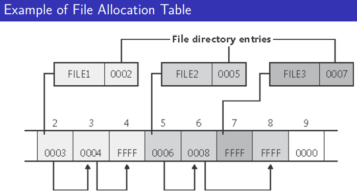
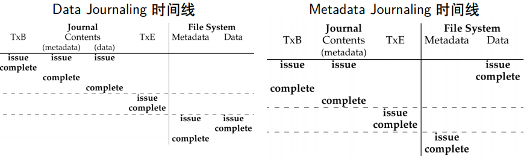
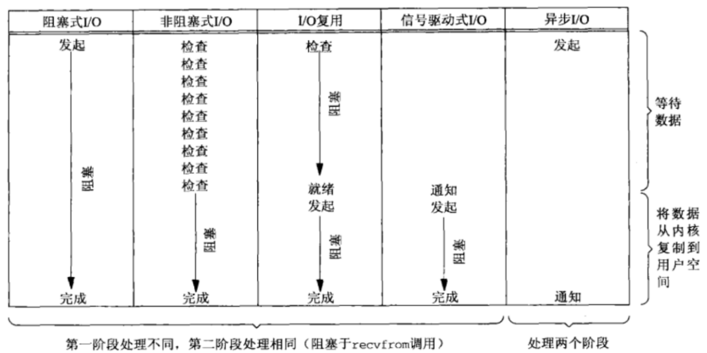

## RISC-V 的中断、异常

以 M 态为例。

#### CSR

mtvec(Machine Trap Vector)：发生异常时处理器需要跳转到的地址 

mepc(Machine Exception PC)：指向发生异常的指令 

mcause(Machine Exception Cause)：发生异常的种类 

mie(Machine Interrupt Enable)：处理器目前能处理和必须忽略的**中断**

mip(Machine Interrupt Pending)：正准备处理的**中断** 

mtval(Machine Trap Value)：附加信息：地址异常中出错的地址，非法指令异常的指令等 

mscratch(Machine Scratch)：暂时存放一个字大小的数据 

mstatus(Machine Status)：机器的状态，包括全局中断使能位 MIE MPIE

#### 硬件异常处理流程

- 异常指令的 PC 被保存在 mepc 中，pc 置为 mtvec
  （对于同步异常，mepc 指向导致异常的指令；对于中断它指向中断处理后应该恢复执行的位置） 

- 设置 mcause 和 mtval

- 把 mstatus 的 MIE 置零，以禁用中断，把先前的 MIE 值保留到 MPIE 中

  这禁止了嵌套中断的发生，具体到 rCore 实验，一个现象是：发起系统调用的用户程序在返回用户态前不会被 S 态时钟中断抢占；如果时钟中断发生，将 Pending，在返回用户态后立刻触发。

- 发生异常前的权限模式保留在 mstatus 的 MPP 域中，再把权限模式更改为 M

- 软件异常处理结束后，执行 mret，权限模式设置为 mstatus 的 MPP 域，同时将 pc 的值设置为 mepc，将 MIE 设为 MPIE.

#### 异常委托

mideleg 和 medeleg

#### Interrupts

外部中断都由 Platform‐Level Interrupt Controller (PLIC) 对接和管理。

## 内存管理

### 连续内存分配

- 最先匹配
- 最佳匹配
- 最差匹配

#### 碎片整理

- 紧凑：移动分配给进程的内存分区，以合并外部碎片
  - 条件：所有应用程序可以动态重定位
- 分区对换：将等待状态进程的内存分区交换到外存
  - OS 要维护内存/外存分区和进程的对应关系

#### 伙伴系统


#### SLAB 分配器

> 了解motivation即可

减少伙伴系统分配小块连续内存时产生的内碎片，缓存频繁使用的对象，减少这些对象的申请、释放、初始化开销。


slab 组成 kmem_cache，slab 又由多个连续 page 组成，page 包含特定大小的 object.

- slob 和 slub：slab 的简化版

### 非连续内存分配

- 段式：可理解为变长的页
  - 支持方便的数据保护
- 页式：页面 (逻辑页) -- MMU/TLB --> 页帧 (物理页)
  - 存储利用率高，且地址转换方便
- 段页式：在页式存储的基础上，**增加指向页表的间接索引**
  - 逻辑地址：（段号，页号，偏移）
  - 只要共享段号就能实现共享该段所有页

### 页表

- 引入页表后，页帧分配**不再产生外碎片**。
- 在必要时清空 TLB.

- 多级页表节省内存。

#### 反置页表

规避多进程映射同一物理页的页表开销，节省内存。


页表项为 (PID, VPN, DATA)

- DATA 为指向下一个页表项的指针 (封闭散列) 或者 PPN.

#### 自映射页表

优势：可以通过简单运算，由虚拟地址直接得到所需二级页表项的物理地址。节省一个页面的内存，便于修改页表。

代价：会占用一大片**连续**地址空间，对于 x86-32 来说是 4 MB。

**分析**：对于 x86-32 位机，每页大小 4 KB，如果用于存储页表可存放 $2^{10}$ 个 PTE。

将 32 位虚拟地址表示为三元组 $(x,y, z)$, $0\le x,y\le 2^{10},0\le z\le 2^{12}$

假设一级页表的第 $e$ 个 PTE 指向本页，则该项的虚地址为 $(e, e, 4e)$，一级页表所在页的虚地址为 $(e, e, 0)$.

一级页表的第 $k$ 项指向某二级页表，这个 PTE 的虚地址是 $(e,e,4k)$，对应二级页表虚地址是 $(e,k,0)$.

这个二级页表的第 $j$ 项指向某物理页，这个 PTE 的虚地址是 $(e,k,4j)$，对应页虚地址是 $(k,j,0)$.

注意到：
$$
(e,e,4k)<<10=(e,k,0)\\
(e,k,4j)<<10=(k,j,0)
$$
要访问 $(k,j,0)$，需要获得虚地址为 $(e,k,4j)$ 的 PTE.

而一级页表物理基址保存在寄存器中，设为 (A, B, 0)，欲获取 PTE 的物理地址是：
$$
(A,B+k-e,4j)
$$

### 虚存

- 覆盖：由编程者手动控制，使得没有调用关系的模块可以占据同一块内存。
- 交换：以整个进程的地址空间为单位换入/换出内存

#### 缺页异常

有效存储访问时间 

EAT = 访存时间 * (1-缺页率) + 缺页异常处理时间 * 缺页率 * (1 + 页修改率)


### 局部页面置换算法

局部页面置换算法只置换**当前进程占用的物理页面**，全局置换算法可选择所有可换出的物理页面。

目标：尽可能减少页面的调入调出次数，降低缺页率，提高访存性能。

- OPT：换出未来最晚使用的页面；不可实现，作为benchmark

- FIFO：换出最早进入内存的页面；简单，效率较低

- LRU：换出最久未使用的页面；开销大、较精确

- Clock：设置访问位，访问时置1，缺页时循环遍历页面，访问位为1者置0，访问下一个页面，为0者换出，结束

  - 注意换出后，指针指向下一个页面；访存命中时，指针不移动。

  - **改进** 二次机会法：增加修改位，用两位二进制表示访问、修改，缺页时11->01，10->00，01->00，00替换。

- LFU：记录每个页面的访问次数，缺页时换出访问次数最少的；开销大

  - 定期将访问计数右移

计算缺页次数时，注意考虑初始化时的**必然缺失**。

#### Belady 现象

给进程分配的物理页面数增加，缺页次数反而上升。

- FIFO/CLOCK 有此现象，LRU/OPT 没有

### 全局页面置换算法

全局置换算法为进程分配可变数目的物理页面。

#### 工作集置换算法

**工作集** $W(t, \Delta)$ 是指在当前时刻 $t$ 前的  $\Delta$ 时间窗口中的所有访问页面所组成的集合.

**常驻集** 当前时刻进程实际驻留在内存中的页面集合。

- 常驻集是工作集子集时，缺页少。

每次访存/缺页时换出不在工作集里的页面。

#### 缺页率置换算法

缺页率 = 缺页次数/访存次数

- 通过控制常驻集大小把缺失率控制在一定范围内。

访存时，给页面设置引用位标志。

缺页时，计算上次缺页时间到本次缺页时间之差 delta

- 如果 delta > T, 则置换两次缺页间隔中所有未被引用的页。
- 如果 delta <= T, 增加缺失页到工作集中。

#### 抖动问题

进程数过多，分配给每个进程的常驻集太小，进而导致大量缺页的现象。

进行负载控制，选择合适的进程数量。

### 面向缓存的页置换算法

传统的页面置换算法如 LRU 在 IO 瓶颈的情境下会出现缓存污染的现象。

- 这里的缓存指的是应当是由 OS 管理的某个内存区域，不是 CPU 的 cache.

> 这部分估计不会细考。

#### FBR

LRU+LFU=FBR 访问频率置换算法


未缓存块读入后放到栈顶，引用计数初始化为 1.

栈中缓存块被访问时移到栈顶，如果它之前不在新区域，其引用计数加 1.

在旧区域引用计数最小的块被替换。

- 需要人为划分三块区域

#### LRU-K

> 这个算法描述得很不明确

历史访问记录队列：将访问次数达到 K 次的块（指针）移入缓存队列。按照 FIFO/LRU 淘汰块。

缓存队列：将块按访问时间戳排序（堆序），替换时换出 “倒数第 K 次访问离现在最久” 的块。

#### 2Q

FIFO 缓存队列：块第一次被访问时加入，第二次被访问时将块移入 LRU 队列。按照 FIFO 淘汰缓存块。

LRU 队列：按照 LRU 规则淘汰块。

- 是 LRU-2 的改进，主要区别是令历史访问队列记录也缓存内存块。

#### FIFR

Recency：页面上次访问至今访问了多少其他页。

IRR：页面最近两次的访问间隔，如果该页只访问了一次，则为 inf.

缓存块被分为 LIR 和 HIR 两部分。

- 当 LIR 块的 Recency 超过常驻集 IRR 最大值 (不考虑 inf)，且 HIR 块在一个更小的 Recency 中被访问，两者的状态就会交换。

具体实现用到栈 S 和栈 Q。

- 栈 S 维护块的 Recency，栈 Q 维护常驻的 HIR 块。

**初始化**：

- 当 LIR 数目小于 $L_{iir}$ 时，所有新缓存页都被设置为 LIR 块。

**替换算法**：

访问栈 S 中的 LIR 块 X：LIR 块必定驻 cache 中，所以必定命中缓存。 然后把块 X 移动到栈 S 的头部，如果块 X 之前是在栈 S 的底部，则执行“栈裁剪”操作。

访问驻 cache 中的 HIR 块 X，把 X 移动到栈 S 头部，有两种情况： 

1. X 在 S 中，X 状态转换为 LIR，删除 Q 中 X，把 S 底部的 LIR 块转为 HIR 块，移动到 Q 中，最后“栈裁剪”。 
2. X 不在 S 中，则 X 状态保持 HIR，从队列 Q 中移动到 Q 头部。

访问非驻留的 HIR 块 X。删除 Q 尾部的 HIR 块，如果该块在栈 S，则变为非驻留状态。加载块 X，把 X 移动到栈 S 的顶部。有两种情况： 

1. X 在 S 中，改变状态为 LIR，并同时改变栈底部的 LIR 块为 HIR 块，并移动到队列 Q 的头部，然后“栈裁剪”。
2. X 不在 S 中，则状态为 HIR，并放到队列 Q 的头部。

## 进程和处理机调度

### 进程、线程、协程

进程的状态模型

- 三状态模型
- 挂起进程模型

进程是资源调度的单位，线程是处理器调度的单位，协程是编程语言层面（编译器提供）的并发抽象。

**用户线程**：在用户态实现的线程，如 Pthreads

优点：无需特权级切换，允许每个进程有自已的线程调度算法。

缺点：线程发起系统调用而阻塞时，整个进程进入等待；不支持基于线程的处理机抢占，只能按进程分配 CPU 时间.

**内核线程**：内核实现的线程，通过系统调用提供给用户。

优点：线程执行系统调用而被阻塞，不影响其他线程；以线程为单位进行CPU时间分配。

缺点：线程创建、终止和切换开销较大。

轻权线程：一个进程可以有一个或者多个轻量级进程，每个轻量级进程有一个单独的内核栈支持。


fork vs. vfork，Copy on Write 技术。

### 单处理机调度

处理机调度的概念：

1. 从就绪队列中挑选下一个运行的进程。

2. 从多个可用 CPU 中挑选就绪进程可使用的 CPU 资源。

先考虑 1，将在 [多处理机调度](#多处理机调度) 中探讨 2.

一些评价指标：

- 周转时间：进程从初始化到结束的总时间
- 等待时间：进程在就绪队列中的总时间

响应时间、吞吐量、公平性 ...

#### 调度算法

**先来先服务 FCFS**

简单，平均等待时间与进程产生顺序有关，不能及时抢占 CPU 资源。

**短进程优先**

选择就绪队列中执行时间最短的进程。

具有最优平均周转时间。可能导致长进程饥饿，需要精确估计进程的执行时间。

**最高响应比优先**

选择就绪队列中相应比 $R=等待时间/执行时间$ 最高的进程。

是短进程优先的改进，防止了长进程饥饿。兼顾了长进程和短进程。

**时间片轮转 RR**

可看作引入了抢占的 FCFS.

- 要选择合适的时间片长度。

**多级反馈队列**

时间片大小随优先级增加而增加，如进程在当前时间片没有完成，则降到下一个优先级。

- CPU 密集型进程优先级快速下降，IO 密集型进程停留在高优先级。

每个队列有自己的调度策略。

> 当然还有 stride.

#### 实时调度

实时操作系统要求进程尽可能在时间约束内完成。

可调度性表示实时操作系统满足任务时限要求。软时限和硬时限。

调度算法：

- 速率单调：执行周期最短的任务
- 最早截止时间：执行截止时间最早的任务

#### 优先级反置

防止高优先级进程长时间等待低优先级进程所占用资源。

优先级天花板协议：占用资源进程的优先级和所有可能申请该资源的进程的最高优先级相同。

### 多处理机调度

SMP 对称多处理系统，NUMA 非一致内存访问系统。

缓存亲和性：尽可能让进程在一个 CPU 上运行。

**多队列多处理器调度**

每个 CPU 有一个调度队列，进程产生时放入某个就绪队列，各个 CPU 之间的调度独立。

- 有良好的可扩展性和缓存亲和性，但负载不均衡。

**应对负载不均**

进程迁移：进程跨 CPU 迁移。

工作窃取：进程量较少的 (源) 队列检查其他 (目标) 队列是不是比自己的进程多，并在满足条件时就从目标队列”窃取”一个或多个进程。

### 实用调度算法

#### O(1) 调度

Linux 2.6 实现了 O(1) SMP 调度器。

- 140 种进程优先级，对应一个长为 140 的数组，每个数组元素都是一个 FIFO 队列，管理该优先级的进程。
- 用 bitmap 记录数组的每个位置是否有进程。用一条硬件指令取出 left-most bit，在 O(1) 时间内完成新进程选取。

#### CFS 调度

vruntime = 实际运行时间 * 1024 / 进程权重

优先选取 vruntime 最小的进程，用 RB tree 维护进程有序性。

- 每个 CPU 维护一个 RB tree.
- 新进程/休眠进程/迁移到新 CPU 进程 的 vruntime 以 RB tree 中的最小值 min_vruntime 为基础设定。
- 休眠进程在醒来的时候大概率抢占 CPU，这**保证了交互式进程的响应速度**。

与 O1 调度相比，性能略输一筹，更加强调公平性。在 Linux 2.6.23 中取代了 O1 调度。

#### BFS 调度

所有 CPU 共享一个双向链表结构的单就绪队列；  

所有线程按优先级排队；相同优先级的线程按虚拟截止时间排序。

在多处理机情况下，单就绪队列增加了互斥访问的开销，但减少了负载均衡算法开销。

## 同步互斥

### 临界区的实现

**禁用中断**

- 禁用中断后，无法用时钟中断打断进程，并发不复存在。
- 只适用于单核。

临界区可能很长，导致其它进程一直饥饿。

**基于软件的解决办法**

- 两进程：Peterson 算法
- 复杂，需要忙等待。

#### 锁

如何实现自旋锁？

- 利用硬件提供的原子原语，如 Test-And-Set

  ```c++
  class Lock { int value = 0; }
  Lock::Acquire() {
      while (test_and_set(value));
  }
  Lock::Release() { value = 0; }
  ```

  其他实现方式：Compare And Swap / Fetch And Add

- 将阻塞线程加入等待队列，可实现无忙等待锁。

**适用于多/单处理器**。

#### 信号量

两个原子操作：

```c++
Semaphore::P(); // sem--; wait if sem < 0;
Semaphore::V(); // sem++; wake up a thread if sem <= 0;
```

`sem` 表示资源的数量。大于零表示还有闲置资源可供使用，小于零表示已无资源可分配，且有进程在阻塞中。

- **实现锁**

  ```c++
  mutex = new Semaphore(1);
  
  mutex->P();
  /* 临界区 */
  mutex->V();
  ```

- **实现同步**

  ```c++
  condition = new Semaphore(0);
  
  // ...
  condition->P();
  // ...
  					// ...
  					condition->V();
  					// ...
  ```


#### 条件量和管程

```c++
class Condition {
    WaitQueue q;
}

Condition::Wait(Mutex lock) {
    Add current thread to q;	// 该操作必须在锁的保护下进行
    lock.release();
    schedule();
    lock.require();
}

Condition::Signal() {
    if (!q.empty()) {
        Remove a thread t from q;
        wakeup(t);
    }
}
```

**管程** 是一种抽象的程序结构概念。

- 在对象/模块中，收集相关共享数据，定义访问共享数据的方法
- 任一时刻最多只有一个线程执行管程代码，正在管程中的线程可临时放弃管程的互斥访问

不同的实现方案：

- Hoare 管程：signal 释放锁
- Hassan/Mesa 管程：signal 不释放锁

#### 并发经典问题

- 生产者、消费者问题
- 哲学家就餐问题
- 读者-写者问题

### 死锁

出现死锁的必要条件：互斥，持有并等待，非抢占，循环等待。

死锁预防：采用某种策略，限制并发进程对资源的请求，使系统在任何时刻都不满足死锁的必要条件。

死锁避免：在分配资源时判断是否会出现死锁，只在不会死锁时分配资源。

死锁是不安全状态的子集。

#### 银行家算法

用于死锁避免。

- 检测资源分配后，是否有一个资源回收顺序，使得所有进程的资源需求都能得到满足。

#### 死锁检测算法

过程类似银行家算法，但用于检测死锁是否已经发生。

## 进程通信

- 直接通信与间接通信：前者例如共享内存，后者如消息队列 / 管道
- 阻塞与非阻塞
- 通信链路缓冲方式

#### 信号

```c
signal(int sig, void (*func)(int));
```

内核实现的一种回调机制。

#### 管道

实验已写过了。

#### 消息队列

以**字节序列**为基本单位的间接通信机制，每个消息是一个字节序列，按 FIFO 接收。

#### 共享内存

把同一个物理内存区域同时映射到多个进程的内存地址空间。

- 快速方便的共享数据，带来同步问题。

## 文件系统

在 OS 看来，文件以块为单位存储在磁盘上，块大小 != 扇区大小。

OS 在打开文件表中维护的打开文件状态和信息，进程以文件描述符标识文件。

- 每个进程有一个打开文件表，另有一个系统级的打开文件表
- 维护文件的状态信息

进程对文件的访问模式：

- 顺序访问，随机访问，索引访问

**目录**是特殊的文件，存储了 <文件名，文件指针> 二元组列表。

- 用户程序应只能通过系统调用修改目录

**文件别名**：

- 硬链接：实验已实现了
- 软链接：存储真实文件的逻辑名称，一种特殊的文件
- 如何避免循环？

数据块缓存：内存中的磁盘块缓存，可与页式管理机制结合。

**文件分配-空闲空间的管理方式**：位图，链表，链式索引。

VFS：在各种文件系统和存储介质之上的统一接口，为上层应用提供服务。

### FAT

File Allocation Table, 由微软为小容量存储介质而设计的简单文件系统。

```
| Boot sector | FAT1 | Copy of FAT1 | Root Dir | others |
```



- 用扩展的 Folder Entry 存储长文件名。

### EXT4

- 脱胎于 MINIX FS，MINIX FS 的磁盘布局，目录索引方式基本与实验 Easy-fs 相同。

**支持大容量存储**

引入一段连续的存储块 extent，取代之前的树形 inode.


**支持恢复异常** 

File System Checker：太慢

日志 Journaling：更新磁盘时，在覆盖相关结构之前，先写下一点日志（在磁盘上某个设定好的其他位置），以描述要执行的操作。

- Data Journaling
  - 批处理日志更新
  - 使日志有限：循环日志
- Metadata Journaling：强制首先写入数据，保证 inode 永远不会指向垃圾数据。



**ZFS**，简要了解一些特色: Everything is COW. Everything is transactional. 由软件实现的 RAID.

## IO 子系统

常见设备类型：字符设备、块设备、网络设备。

**设备传输方式**

- 程序控制 I/O：基于轮询的抽象设备接口

  ```rust
  while STATUS == BUSY {};	// 等待设备执行完毕
  send(DATA, COMMAND);		// 把命令、数据发给设备
  while STATUS == BUSY {};	// 等待设备执行完毕
  ```

- 中断传输方式: 基于中断的抽象设备接口

  ```rust
  send(DATA, COMMAND);		// 把命令、数据发给设备
  do_otherwork();				// 做其他事情
  ...							// IO 设备完成操作，产生中断
  trap_handler();				// CPU 响应中断，执行相关 IO 处理
  restore_do_otherwork();		// 之后可继续发起 IO 操作
  ```

- DMA

**IO 执行模型**

- 阻塞 IO
- 非阻塞 IO：等待数据阶段为非阻塞
- 多路复用 IO：通过轮询检查数据报是否准备好
- 信号驱动 IO：以回调函数在数据准备好后处理
- 异步 IO：在将数据从内核复制到用户空间阶段，也不会阻塞



### 磁盘调度算法

寻道时间是磁盘访问最耗时的部分，要尽可能减少磁头移动的距离。

- FIFO：即先来先服务
- SSTF 最短服务时间优先：选择从当前位置需要移动磁头最少的 IO 请求
- SCAN 扫描算法：在一个方向上移动，访问所有未完成的请求，直到到达该方向最后的磁道再调转方向。
- CSCAN：仅在一个方向上扫描，到达最后一个磁道后，返回到磁盘的另外一端再次进行

SSTF、SCAN 及 CSCAN 等算法中，可能出现磁头停留在某处不动的情况。

- N 步扫描算法：将磁盘请求队列分成长度为 N 的子队列，按 FIFO 算法依次处理所有子队列，扫描算法处理每个队列。
- 双队列扫描算法：将磁盘请求分成两个队列，交替使用扫描算法处理一个队列，新生成的磁盘 I/O 请求放入另一队列中。


