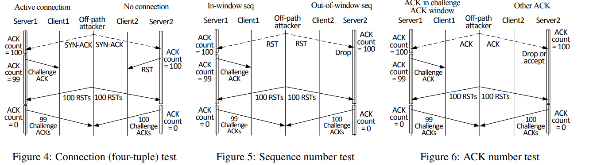

# 课后作业 Week9

2018011365 张鹤潇

### 第七章

#### 1 请简述以下三种常见的内存防御机制的原理：
  a. W^X (Write XOR eXecution)
  b. ASLR (Address Space Layout Randomization)
  c. Stack Canary
并分析这三种防御机制能否防御面向返回地址编程 (ROP) ，原因是什么？

W^X 使每个内存页要么可写，要么可执行，不可兼具两者。

ASLR 随机初始化虚地址空间中的基地址，包括共享库基地址、栈区基地址和堆区基地址，以防止恶意代码定位进程虚拟空间当中的重要地址。

Stack Canary 在保存的栈帧基地址（EBP）后插入一段信息，当函数返回时验证该信息是否被修改过，以对抗栈区溢出攻击。

W^X 不能防御 ROP，因为 Gadget 都取自代码段，必然有执行权限。

ASLR 不能防御 ROP，因为 ASLR 不能对代码段基地址进行随机初始化。

Stack Canary 能防御 ROP，因为 ROP 的实现依赖栈溢出，stack canary 能检测栈溢出是否发生，从而避免 ROP.

#### 2 控制流完整性保护 (CFI) 判断进程控制流被劫持的依据是什么？

CFI 源代码分析得到程序的控制流图, 获得转移指令目标地址的列表.

如果运行时转移指令的目标地址不在列表中, 说明程序控制流被劫持了, CFI 将阻止这种行为.

### 第八章

#### 1 请描述IP分片污染攻击的原理与攻击者需要具备的能力。

原理: 在原始报文被分片、传输过程中，攻击者伪造一些分片，注入到正常分片流中，篡改原始报文内容，从而形成对合法流量的污染.

攻击者需要具备: 伪造源地址的能力, 猜测 IPID 的能力, 伪造原始报文校验和的能力.

#### 2 请画图描述基于Challenge ACK侧信道漏洞的TCP连接劫持的原理。

TCP challenge ack 包默认在 1s 内至多发送 100 个.  

攻击者可以在 1s 内向服务器发送 100 个伪造的 TCP 连接重建 (SYN) 包, 如果伪装成功, 则攻击者只能收到 99 个 challenge ack 包, 另一个包将被发给用户.

由此, 攻击者可通过枚举确定 TCP 连接的关键参数, 包括 IP, Port, Sequence Number, 从而劫持 TCP 连接.

