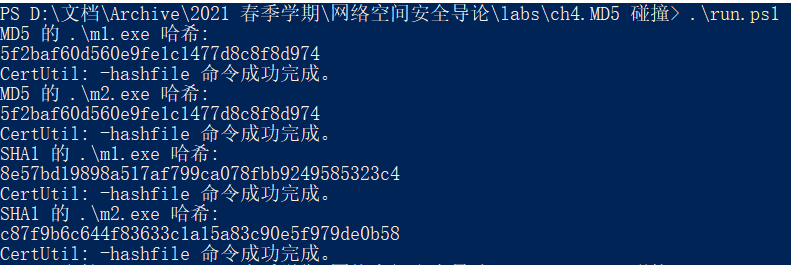
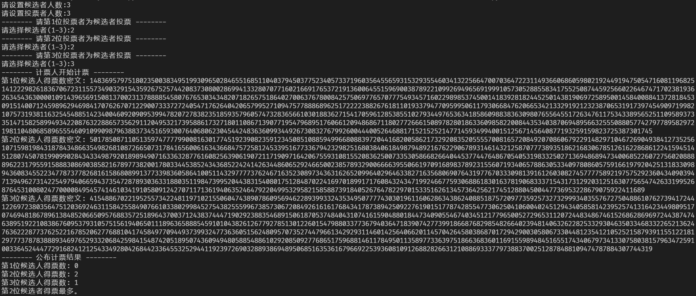

# 制造MD5算法的散列值碰撞

2018011365 张鹤潇

### 环境设置

Windows 10 20H2

使用到的软件包括：fastcool_v1.0.0.5

制造散列冲突的目标是 python.exe 可执行文件。

### 关键步骤和源码

本次实验非常简单，在命令行下调用 fastcool 生成冲突文件即可：

```powershell
./fastcoll_v1.0.0.5.exe -p python.exe -o m1.exe m2.exe
```

验证生成的两个文件 MD5 散列值相同。

```powershell
certutil -hashfile ./m1.exe MD5
certutil -hashfile ./m2.exe MD5
```

进一步验证可知二者的 SHA1 散列值不同。

### 实验结果




# 基于Paillier算法的匿名电子投票流程实现

2018011365 张鹤潇

### 环境设置

实验环境为 Windows 10 20H2, Python 3.9.4, 

依赖 `phe==1.4.0` 库实现 Paillier 算法。 

### 关键步骤和源码

借助 phe 库实现的 Paillier 算法，可以很容易的实现同态加密。

先生成一对公钥和私钥：

```python
public_key, private_key = paillier.generate_paillier_keypair()
```

用公钥对每位投票人的选择进行加密：

```python
choi = int(input(f"请选择候选者(1-{num_candidate}):"))
for i in range(num_candidate):
    res = i + 1 == choi
    candidate_votes[i].append(public_key.encrypt(res))
```

投票完成后，基于同态性质进行计票：

```python
secrets = [sum(candidate_vote) for candidate_vote in candidate_votes]
```

计票人以私钥解密计票结果，得到每位候选者的得票数：

```python
ans = [private_key.decrypt(secret) for secret in secrets]
```

这就是匿名投票的实现方法。

### 实验结果

