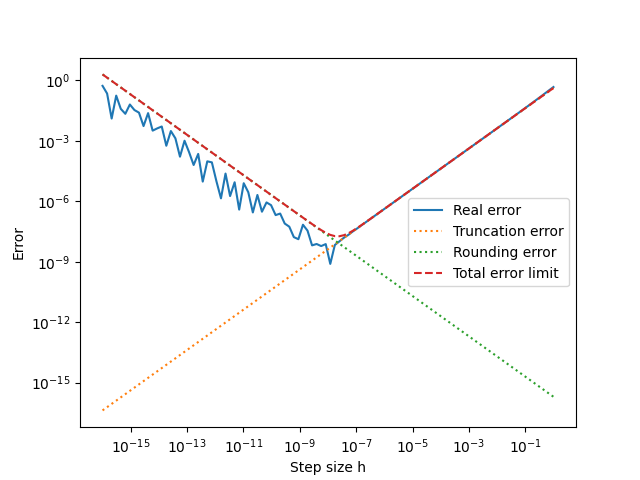

# 数值计算导论

张鹤潇 2018011365

```bash
python lab1.py  # 运行代码
```

### 实验题1

#### 解题思路

以例1.4为依据，分别计算截断误差，舍入误差，总误差限，实际误差。
$$
\epsilon_T = \frac{Mh}{2}\\
\epsilon_R=\frac{2\epsilon}{h}\\
\epsilon_{tot}=\frac{Mh}{2}+\frac{2\epsilon}{h}\\
\epsilon_{real}= \left|\frac{\sin(1+h)-\sin(1)}{h}-\cos(1)\right| \\
$$
式中取 $M=1,\epsilon=10^{-16}$，$h$ 在 $10^{-16}$ 到 $1$ 之间的对数坐标系下均匀取点。

当 $h=2\sqrt{\epsilon/M}\approx 10^{-8}$ 时，总误差限达到最小。

#### 关键代码

```python
    h = np.logspace(-16, 0, 100)
    real_err = np.abs(np.cos(1) - (np.sin(1 + h) - np.sin(1)) / h)
    trunc_err = np.sin(1) * h / 2
    rounding_err = 2 * 1e-16 / h
    tot_err = trunc_err + rounding_err
```

#### 实验结果

成功重现了例1.4的结果。



可见，截断误差随步长的增大而增大，舍入误差随步长的增大而减小，总误差限和实际误差都先减小后增大。

### 实验题3

#### 解题思路

当
$$
\frac{1/n}{\sum_{i=1}^{n-1}1/i}<\frac{1}{2}\epsilon_{machine}
$$
时，计算值必将开始不变。考虑到$\sum_{i=1}^{n-1}1/i\approx\ln{n}+\gamma$，可以用二分法估计 $\frac{1}{[\ln{n}+\gamma]n}=\frac{1}{2}\epsilon_{machine}$ 的根 n 的数量级。

计算得，对于单精度浮点数：$n\approx 2\times 10^{6}$

对于双精度浮点数：$n\approx 5\times 10^{14}$

对于 (1)(2) 小问，直接计算即可；对于 (3) 小问，$n$ 的数量级过大，取 $n=10^{8}$ 估算用时。

#### 关键代码

```python
 	# (1)
    dtype = np.float32
    sum_float, n = dtype(0), 0
    while True:
        n += 1
        cur_sum = sum_float + dtype(1 / n)
        if cur_sum == sum_float:
            break
        sum_float = cur_sum
    print(f"对于IEEE单精度浮点数，n = {n} 时求和结果不再变化")

    # (2)
    sum_double = sum(1 / i for i in range(1, n + 1))
    print(f"绝对误差: {sum_float-sum_double}")
    print(f"相对误差: {(sum_float-sum_double)/sum_double}")

    # (3)
    start = time.perf_counter()
    n = int(1e8)
    sum(1 / i for i in range(1, n + 1))
    elapsed = time.perf_counter() - start
    print(f"累加到 1e8 用时: {elapsed} s")
```

#### 实验结果

```bash
对于IEEE单精度浮点数，n = 2097152 时求和结果不再变化
绝对误差: 0.270376013662041
相对误差: 0.017866287858289122
累加到 1e8 用时: 5.713183300000001 s
```

1. 当 n = 2097152 时求和结果不再变化。
2. 绝对误差 $0.2704$, 相对误差 $1.787\%$
3. 计算前 $10^{8}$ 项用了 $5.71$ s, 估计计算完毕需要 $2.86\times10^7\ s=330\ day$.