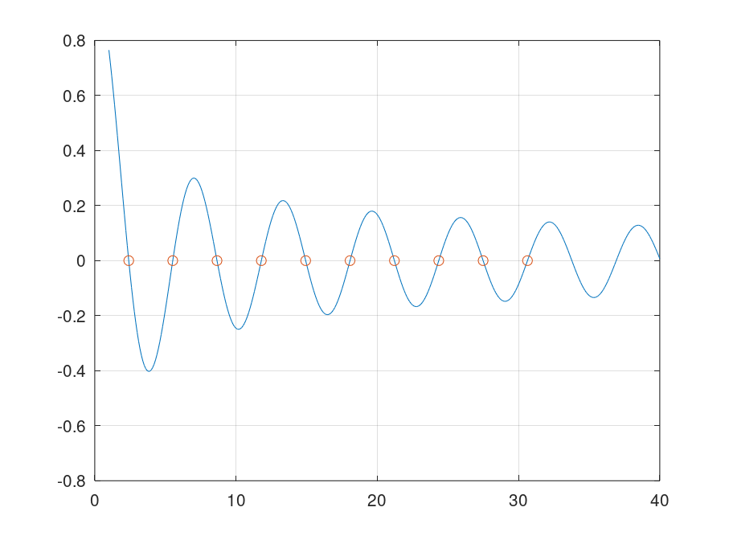

# 非线性方程求根

2018011365 张鹤潇

```bash
python lab2_2.py	# 运行第二题
```

用 MATLAB 运行 `lab2_3.m` 可得第三题结果。

### 实验题2

#### 解题思路

设定下山因子初始值 $\lambda_0=0.9$, 判停条件 $(|f(x)|<\epsilon)\ ||\ (|x_{next}-x|<\epsilon)$，$\epsilon=10^{-8}$

下山因子用折半法更新，将结果与 `scipy.optimize.fsolve` 对比，以验证正确性。

#### 关键代码

```python
	k = 0
   	print(f"Step {k}, x = {x:.10f}, f(x) = {f(x):.10f}")
    while abs(f(x)) > epsilon or abs(x - x_next) > epsilon:
    	s = f(x) / df(x)
        x_next = x - s
        lamda = lamda0
        while abs(f(x_next)) >= abs(f(x)):
        	x_next = x - lamda * s
            lamda *= 0.5
        x = x_next
        k += 1
       	print(f"Step {k}, x = {x:.10f}, f(x) = {f(x):.10f}, lambda = {lamda}")
```

#### 实验结果

对于 $x^3-x-1=0,x_0=0.6$,

```
Step 0, x = 0.6000000000, f(x) = -1.3840000000
Step 1, x = 1.5731249988, f(x) = 1.3199224561, lambda = 0.028125
Step 2, x = 1.3676629520, f(x) = 0.1905532672, lambda = 0.9     
Step 3, x = 1.3263416845, f(x) = 0.0069350828, lambda = 0.9     
Step 4, x = 1.3247204087, f(x) = 0.0000104547, lambda = 0.9     
Step 5, x = 1.3247179573, f(x) = 0.0000000000, lambda = 0.9     
Solution: x = 1.3247179573
fsolve solution: [1.32471796]
```

对于 $-x^3+5x=0,x=1.35$,

```
Solving -x^3 + 5x = 0:
Step 0, x = 1.3500000000, f(x) = 4.2896250000
Step 1, x = 2.3822627003, f(x) = -1.6084455847, lambda = 0.05625
Step 2, x = 2.2485100904, f(x) = -0.1254615265, lambda = 0.9
Step 3, x = 2.2361704938, f(x) = -0.0010252336, lambda = 0.9
Step 4, x = 2.2360679845, f(x) = -0.0000000705, lambda = 0.9
Step 5, x = 2.2360679775, f(x) = -0.0000000000, lambda = 0.9
Solution: x = 2.2360679775
fsolve solution: [2.23606798]
```

在两个问题中，程序都只经过五次迭代就得到了符合要求的解，且阻尼因子 $\lambda$ 只在第一次迭代中起了效果。阻尼牛顿法解决了牛顿法当初始值 $x_0$ 偏离准确解 $x^*$ 较远时可能发散的问题。

### 实验题3

#### 解题思路

利用课本提供的 `fzerotx` 函数计算 $J_0(x)$ 的前十个正零点， 取初始区间 $[2+3k,5+3k],k\in \{0,1,\cdots,9\}$.

#### 关键代码

```octave
ab = [[2 : 3 : 31]; [5 : 3 : 34]]';
x = [1:0.1:40];
f = @(x) besselj(0, x);
roots = zeros(1, 10);
for i = 1:10
    roots(i) = fzerotx(f, ab(i, :)); 
end
plot(x, f(x), roots, f(roots), 'o')
```

#### 实验结果

前十个零点：

```
2.404826 5.520078 8.653728 11.791534 14.930918
18.071064 21.211637 24.352472 27.493479 30.634606
```

绘制图像：

