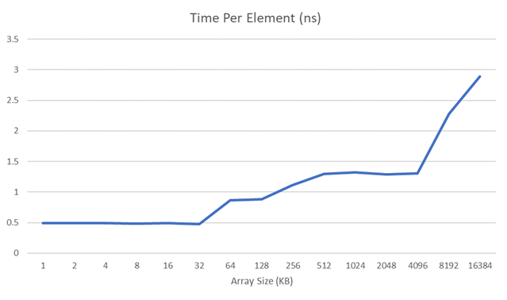

# Cache 测量实验报告

2018011365 张鹤潇

### Step 0. 实验准备

我在 `WSL2 Ubuntu-18.04` 上完成实验，缓存参数如下：

- L1D Cache Size 为 32 KB.
- L2 Cache Size 为 256 KB.
- L3 Cache Size 为 9 MB.
- L1D Cache Line Size 为 64 B.
- L1D Cache 为 8 路组相联.

下面的实验将验证这些参数。

### Step 1. 测量 L1D Cache Size 和 L2 Cache Size

以数组循环访问为访存模式进行测试。对于长度为 $N=2^n$ 的整形数组 `data`，循环访问 `data[0], data[16], ..., data[2^n-16]` 固定次数，测量平均访存时间。这里以 16 (即 64 B) 为访问步长，是为了尽可能刷新缓存行。

实验结果如下：

当数组大小从 32 KB 增加到 64 KB, 或从 256 KB 增加到 512 KB 时，平均访存时间有明显增加，这表明程序出现了 Cache 读缺失。这就验证了 L1D Cache Size 为 32 KB，L2 Cache Size 为 256 KB.

### Step 2. 测量 L1D Cache Line Size

以数组循环访问为访存模式进行测试。对于长度为 1 MB 的整形数组 `data`，以步长 $L = 2^l$ 循环访问 `data[0], data[L], ..., data[1MB/sizeof(int)-L]` 固定次数，测量平均访存时间。

预期在 $L\times \text{sizeof(int)}$ 超过缓存行大小后，程序的平均访存时间将明显增加。

实验结果如下：

当访问步长超过 64 B 时，程序的平均访存时间大幅增加，这验证了 L1D Cache Line Size 为 64 B.

### Step 3. 测量 L1D Cache 相连度

将长为 64 KB 的整形数组分成 $2^n$ 块，循环访问奇数块的首元素固定次数。

对上述算法的详细分析如下：设缓存相连度为 $2^k$, 则虚拟地址每隔 $2^{15-k}$ B 将被映射到同一缓存行内，而奇数块首元素的地址差为 $2^{17-n}$ B，奇数块共有 $2^{n-1}$ 个。

- 当 $n-1\le k$ 时，程序访问的所有元素能被装入同一个 $2^k$ 组相联的缓存行内，而不发生冲突，故访存速度快；
- 当 $n-2\ge k$ 时，程序会引发大量的冲突缺失，导致访存时间增加。

预期在 $n-2=k$ 时，程序的平均访存时间将明显增加。

实验结果如下：

当分组数增长到 32 后，平均访存时间大幅增加，此时 $n = 5$, 对应的 $k=3$, 这就验证了 L1D Cache 为 8 路组相联.

### Step 4. 优化矩阵乘法

我采取的优化策略如下：

- 对被乘矩阵 `b` 做转置，使我们能在矩阵乘法中按行访问 `b`，从而充分利用缓存。
- 注意到 `b` 是三角矩阵，只需遍历其一半元素即可。
- 适当展开内循环。

关闭编译器优化，重复运行十次，平均加速比为 `4.61`.

### Ext 1. L1D Cache 替换策略

我设计了如下算法，来定性判断 L1D Cache 替换策略 (CRP) 是更接近于 FIFO 还是 LRU.

给定长 32 KB (= L1D Cache Size) 的整形数组 `a`，按如下流程执行写操作：

1. 顺序遍历 `a`，将整个数组装入 L1D Cache；
2. 遍历 `a` 的前一半元素；
3. 遍历长为 16 KB 的另一个整形数组 `b`，将 L1D Cache 中一半空间换出；
   - 如果 L1D Cache 的 CRP 为 FIFO，则此时 `a` 的前一半元素被换出；而如果为 LRU，则 `a` 的后一半元素被换出。
4. 顺序遍历 `a` 的前一半或后一半元素；

如果第 4 步中遍历 `a` 的前半部分元素耗时多于遍历后半部分元素，则说明 CRP 接近于 FIFO；反之，则 CRP 接近于 LRU.

实验结果如下：

| 组别          | 遍历前半 | 遍历后半 |
| ------------- | -------- | -------- |
| 平均用时 (ms) | 0.65541  | 0.83140  |

这表明 L1D Cache 的 CRP 接近于 LRU.

### Ext 2. L1D Cache 是否使用写直达策略

测试 L1D Cache 在 write hit 和 write miss 时的平均访存耗时。

给定长 64 KB (= 2 * L1D Cache Size) 的整形数组 `a`，采取如下两种策略访存：

1. 只遍历 `a` 的前半部分，不会触发写缺失；

2. 遍历整个数组，将触发大量写缺失 。

实验结果如下：

| 组别          | 写缺失  | 写命中  |
| ------------- | ------- | ------- |
| 平均用时 (ms) | 0.65422 | 0.13838 |

结果表明，程序在写命中时的访存延迟明显小于写不命中。可见 L1D Cache 使用的不是写直达策略。

### 总结和建议

经过本次实验，我对缓存的作用和行为有了更深入的了解，还是很有收获的。

本次实验总体上难度适中，其中测量 Cache 相连度的难度较大，选做实验难度也较大，但加分太少了。

给本次实验打个 A-。