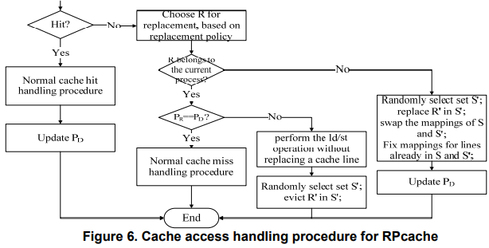

# Cache时间侧信道模拟 Report

2018011365 张鹤潇

### 攻击原理

我从推断敏感数据所在的 cache set 入手，降低攻击中的访存次数。

攻击时首先清空缓存行，访问未知数据 `u`，接着判断 `u` 所在的缓存行位置；获知目标缓存行后，再挨个尝试所有可能被放入该缓存行的物理地址。核心代码如下：

```c++
    // lines = 32, addressses = 800
	cache->flushAny();	cache->accessu();
    int base;
    for (base = 0; base < lines; base++) {
        if (cache->access(base) == 0)
            // 如果命中，说明找到 u
            return base;
        if (cache->accessu() == 1)
            // 如果 u 被替换，说明 u 和 base 在同一缓存行
            break;
    }
    base += lines;
    for (; base < addresses; base += lines)
    { // 尝试 u 所在缓存行的所有可能地址
        if (cache->flush(base) == 1)
            return base;
    }
```

分析代码，知每次攻击最多访存 $2+2\text{#cache set}+\frac {800}{\text{#cache set}}-1=64+25-1=90$ 次.

800 次攻击访存次数 $< 90\times 800=72000$，满足性能要求。

> 进一步计算可知, 精确访存次数为 $800\times2+\sum_{i=0}^{31}(2i+1)+\sum_{j=1}^{24}\sum_{i=1}^{32}(2i+j)=37568$

### 运行结果

```sh
right, operation count :37568
score : 7
```

### 思考题

**如何采取一些措施，防御你使用的cache时间侧信道攻击，并简述措施的有效性。**

我的攻击方式是通过 cache miss 推断敏感数据所在的 cache set，如果内存地址和 cache set 之间的关系是随机的，攻击就不能有效进行。

参考 [RPcache](http://palms.princeton.edu/system/files/p494-wang.pdf)，用一个排列表存储内存地址到 cache set 的映射，每个缓存行都包含其所有进程的ID， 具有不同 PID 的缓存行不能相互替换，而是根据排列表随机选择一个 cache set，替换该集合中的缓存行。这种随机化策略能有效避免本实验中的攻击。



