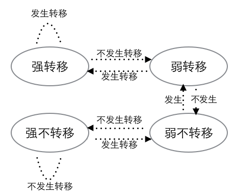

# 实验三（选题二）报告

2018011365 张鹤潇

### 概述和分工

我们组完成了本次实验的所有基本任务和挑战任务，并为分支预测器在 PC 上适配了一套性能测试框架。

### 分支预测器设计

我的分支预测器包括一个二级分支预测部件 `GHR+PHT` 和一个目标地址缓存区 `BTB`，与实验文档的描述基本相同。

全局历史记录寄存器（Global History Register, GHR）记录了全局的历史跳转信息。每次更新分支预测器时，根据上一条分支指令是否跳转更新 `GHR`，

```c
GHR = (GHR << 1) + jump;
```

以 `GHR` 的低位索引历史模式表（Pattern History Table, PHT）, 根据 `PHT` 项的内容进行 2 bit 动态分支预测。`PHT` 项初始化为 10，即弱跳转，此后每次更新分支预测器时更新相应 PHT 项。



BTB（Branch Target Buffer）记录了分支指令的地址到跳转地址的映射。考虑到实验中分支指令的跳转范围有限，只保存地址的低 16 位， `sizeof(BTBEntry)= 4 Byte`。如果 PHT 预测将跳转，则从 BTB 中根据分支指令的地址查找对应的跳转地址。BTB 项的替换策略为 FIFO.

BTB 表中共有 128 项，而 PHT 表中有 2048 项，共计占用内存 `128 * 4 B + 2048 * 2 b = 1 KB`.

### 测例设计

#### 预测器控制测例

以下测例修改自幽灵攻击代码，能使 `x == malicious_x` 时，分支预测器做出错误预测。

```c++
    training_x = 0;
    for (int j = 5; j >= 0; j--) {
        for (int z = 0; z < 10; z++) {
        }	// 控制 GHR

        /* set x=training_x if j%6!=0 or malicious_x if j%6==0 */
        x = ((j % 6) - 1) & ~0xFFFF;
        x = (x | (x >> 16));
        x = training_x ^ (x & (malicious_x ^ training_x));

        /* Call the victim! */
        if (x < array1_size) {
            // do something dangerous
        }
    }
```

`training_x` 能使分支指令执行，而 `malicious_x` 不应该让分支指令执行。

在每轮循环中，先用一个空循环将 GHR 的所有位置 1，前五轮用 `training_x` 训练分支预测器；第六轮循环，遇到 `malicious_x` 时，被训练过的分支预测器会做出错误的预测。

#### 正确率攻击测例

##### 测例 1

以下测例使得分支预测器的正确率从 90% 降低到 60% 左右.

运行结果`pre_times = 517, direction_correct_times = 310, address_correct_times = 307`

```c++
int main(){
    int t = 0;
    int a = 1;
    int arr[] = {1,4,3,2,5,3,5,3,1,2,4,5,4,2,3,1,4,3,1,2,5,3,4,1,4,3,2,5,3,5,3,1};
    int arr2[] = {1,2,1,2,4,1,2,2,3,4,1,1,3,1,4,3,1,3,1,4,1,2,3,1,1}; // 两个随机数数组，arr2的粒度比arr的小
    int arr_iter = 0;
    for (int i = 0; i < 60; i++){ // 先使用arr，每arr[arr_iter]分支转移成功一次
        t++;
        if(t != arr[arr_iter]){
            a += 1;
        }else{
            arr_iter += 1;
            t = 0;
        }
    }
    arr_iter = 0;
    t = 0;
    for (int i = 0; i < 60; i++){// 每arr[arr_iter]分支转移失败一次
        t++;
        if(t == arr[arr_iter]){
            arr_iter += 1;
            t = 0;
        }else{
            a += 1;
        }
    }
    for(int i = 0;i < 11;i++){}
    arr_iter = 0;
    t = 0; 
    for (int i = 0; i < 70; i++){// 每arr2[arr_iter]分支转移失败一次
        t++;
        if(t == arr2[arr_iter]){
            arr_iter += 1;
            t = 0;
        }else{
            a += 1;
        }
    }  
    arr_iter = 0;
    t = 0;  
    for (int i = 0; i < 60; i++){// 每arr2[arr_iter]分支转移成功一次
        t++;
        if(t != arr2[arr_iter]){
            a += 1;
        }else{
            arr_iter += 1;
            t = 0;
        }
    }
    return 0;
}
```

在我设计的分支预测器中， PHT 的每一项初始化为10，即弱转移。攻击的基本思想是先让大部分分支指令不跳转，在正确率比较低的情况下，训练尽可能多的 PHT 项为不转移；然后遍历这些 PHT 项，同时让大部分分支指令跳转，这就降低了分支预测的正确率。

具体来说，维护一个随机数组 `arr`，第一次循环时每 `arr[i]` 轮循环分支指令跳转一次，这样可以尽可能多地遍历 PHT 项并训练其为为不转移；第二次循环中每 `arr[i]` 轮循环转移失败一次，因为在上一轮循环中，PHT 项大部分已被训练为不跳转，而本次循环中大多数分支语句跳转，这就降低了分支预测的正确率。

##### 测例 2

以下测例让分支预测器正确率降低到 40%。该测例用随机数，使得每次分支转移变得完全无法预测，也无规律可循，分支预测器在该测例上表现很差。

```c++
int main() {
    srand(time(NULL));
    int t = 0;
    for(int i = 0;i < 100;i++) {
        if (rand() % 2 == 0){
            t = 0;
        }
        if (rand() % 2 == 0){
            t = 1;
        }
        if (rand() % 2 == 0){
            t = 2;
        }
        if (rand() % 2 == 0){
            t = 3;
        }
        if (rand() % 2 == 0){
            t = 4;
        }
    }
}
```

### 思考题

##### （1）比较ARM A64指令集和你熟悉的一种指令集，说明两者各自的优势和不足。

与 RISC-V 相比，列举二者的异同点如下。

+ 内存寻址方面，RISC-V 只有一种寻址方式，即基址寄存器+偏移量；ARM A64 有五种寻址方式，包括 Base register mode (基址寄存器无偏移)，Base plus offset mode (基址寄存器加偏移)，Pre-indexed mode (把基地址+偏移作为虚拟地址，然后把该虚拟地址写入存有基地址的寄存器)，Post-indexed mode (把基地址作为虚拟地址，然后把该基地址+偏移作为新的虚拟地址写入存有基地址的寄存器)，Literal mode (PC相对寻址)。
+ A64有条件码，riscv没有条件码；

RISC-V 指令集与 ARM A64 指令集相比更加简单，A64 指令集中某些指令需要多条 RISC-V 指令才能实现。RISC-V 指令集更加简单，硬件更容易实现，但同时增加了软件 (编译器) 的负担，而 A64 指令集则正好相反，对硬件要求更高，给软件带来更多便利。

##### （4）请阅读Nailgun攻击论文第III节，说明为何ARM调试架构是不安全的。

+ 对于非入侵式调试，运行在低特权级的程序可以通过PMU和ETM获得高特权级的信息。
+ 对于入侵式调试
  + 低特权级的处理器可以通过 ECT 令处于任意特权级的处理器进入调试模式；
  + 目标处理器在执行指令以及获取资源时，不会考虑调试器的特权级。
  + dcps 指令可以让处于调试模式的目标处理器进入任何高优先级，这样，它就能访问高优先级的资源，并将敏感资源泄露给调试器。
  + Challenge 任务实际上实践了这些攻击原理。

##### （6）Linux内核模块与用户进程的数据交互方式有哪些？请介绍三种以上的方法。

+ 系统调用：系统调用时内核提供给应用程序的接口。应用程序发出系统调用请求进入内核态，在内核态处理完请求后返回用户态，实现内核与用户的数据交互。常见的系统调用包括获得系统时间，读写文件，设置优先级等等。
+ Netlink：netlink是一种在内核与用户应用间进行双向数据传输的异步通信方式，用户态应用通过使用标准的 socket API 就可以使用 netlink ，内核态需要使用专门的内核 API 来使用 netlink。
+ sysctl：通过sysctl，用户应用可以在内核运行时来改变内核的配置参数，也可以在任何时候获得内核的配置参数。
+ 模拟 Device：这是 task3 和我的 Challenge 实现中使用的交互方式。设置一个虚拟设备，内核模块为其提供基本操作函数 (read, write, open...)，内核和用户程序双方按照约定好的格式读写数据。

### 意见和建议

文档中关于树莓派环境配置的说明很不详细，没有必要让同学们在这方面踩坑。我在配置环境时参考了一些博客，罗列如下：

> https://blog.csdn.net/sinat_35821976/article/details/107881644
>
> 用 vscode remote-ssh 连接树莓派，需要在本地 config 文件中指定用户名为 ubuntu.

task3 提供的测例太小。有鉴于此，我对 CBP2 (Championship Branch Prediction 2nd) 提供的测试框架略作修改，用它的测例测试我的分支预测器。这个测试框架可以在 Ubuntu PC 上运行，相比在树莓派上进行内核开发，开发体验好得多。

扩展实验最精妙的地方是利用 Armv8 调试架构漏洞提升目标进程的特权级，只有这样做，才能让目标核执行获取 L1 Cache 的指令。这个关键点并没有在实验文档中点明，需要同学们自己悟。

本次实验是我第一次接触树莓派。实验有一定难度，但也很新奇有趣。文档和框架代码的质量很高，在此感谢助教的辛勤劳动和热情答疑。
